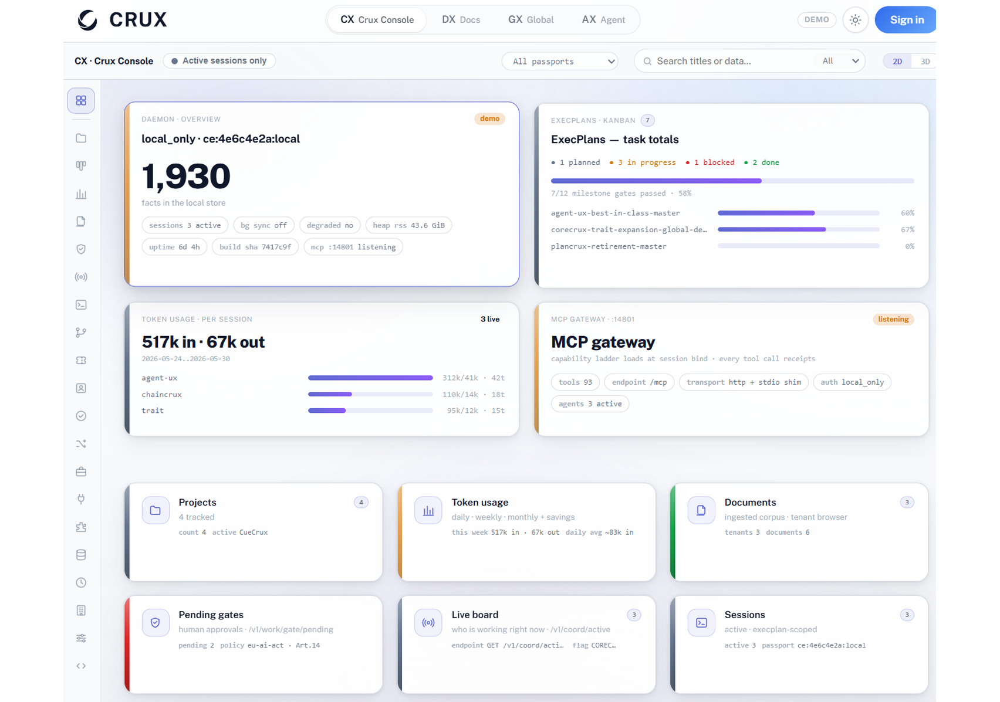
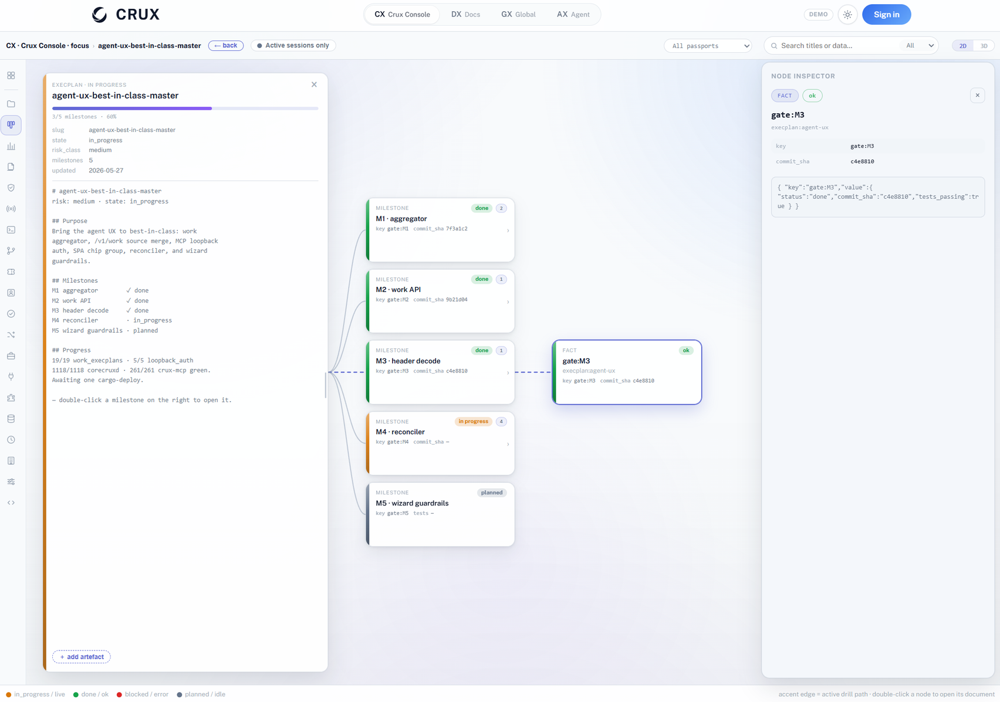
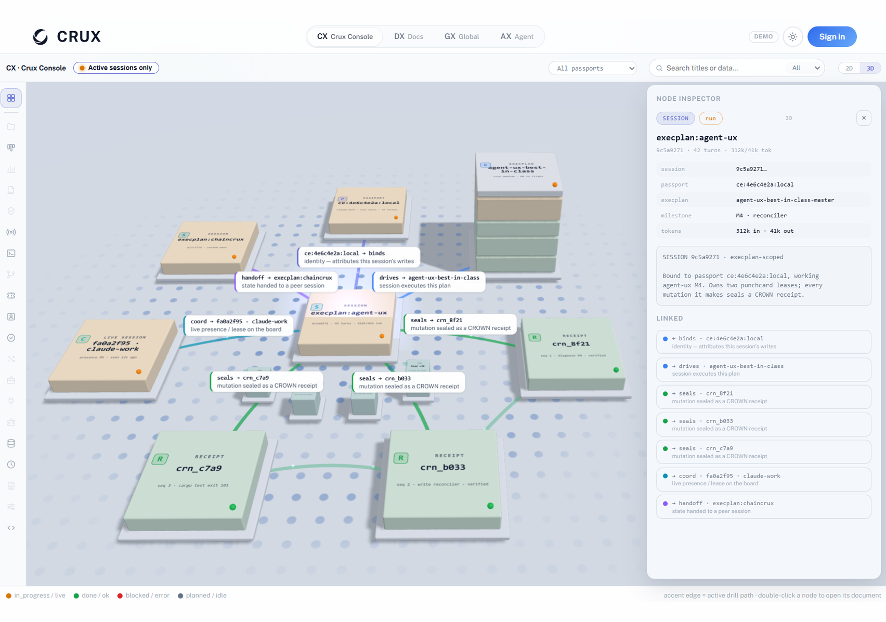
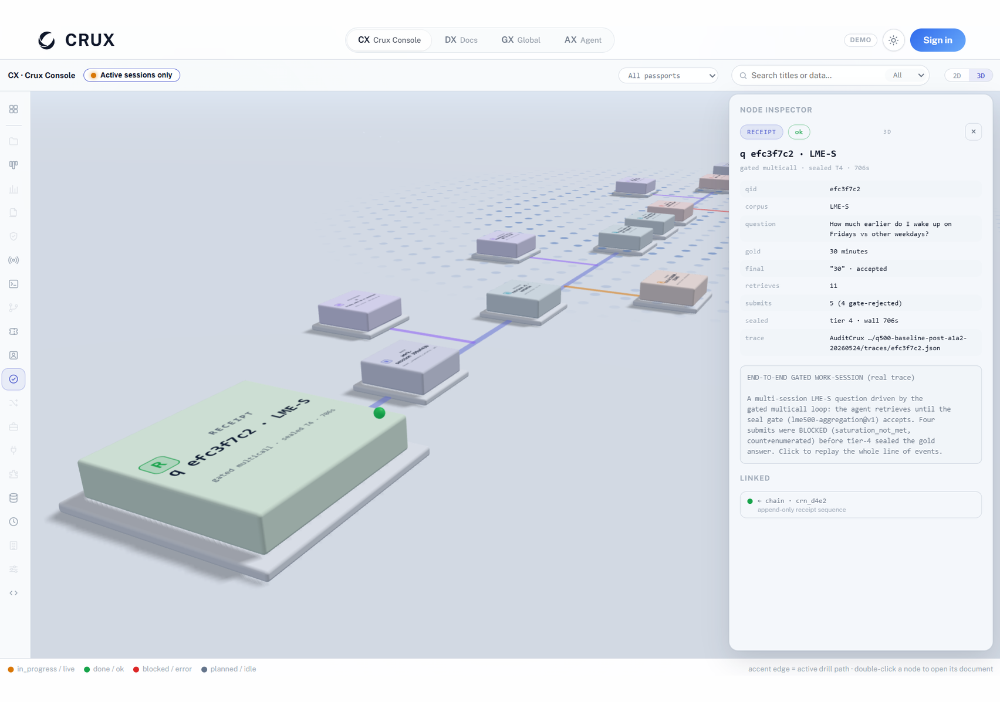
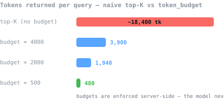
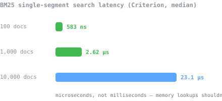
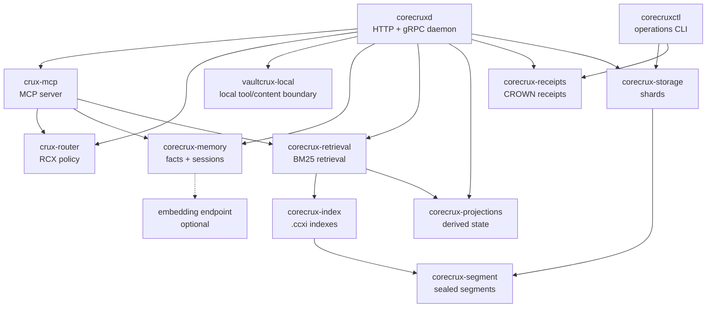
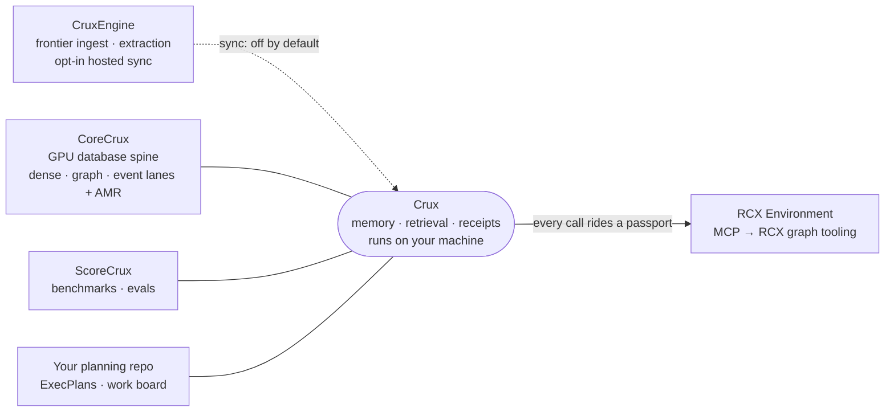

<div align="center">

<picture>
  <source media="(prefers-color-scheme: dark)" srcset="docs/Images/readme/CueCrux-Arc-Loop-White.png">
  
</picture>

# CRUX

### Know what every coding session **cost** — then prove what your agent **did**.

Crux opens on the one number you can't easily get anywhere else — your session's **token burn**:
how much context every model call re-read, where it went, and what to change to cut it
(`corecruxctl session cost`, or the **Token burn** console page). Underneath, it's a local-first
**signed recorder** for AI agents — fact storage with deterministic freshness decay, BM25 + graph
retrieval under hard token budgets, and an Ed25519 receipt for every write.
One binary. No API keys. Nothing leaves your machine.

[Quickstart](#quickstart) · [Console](#the-console) · [How it works](#how-it-works) ·
[Capabilities](#what-you-get) · [EU AI Act](#eu-ai-act) · [Licence](#licence)

[](https://github.com/CueCrux/Crux/actions/workflows/ci.yml)
[](https://github.com/CueCrux/Crux/actions/workflows/coverage-attestation.yml)
[](#mcp-server-for-agents)
[](rust-toolchain.toml)
[-blue)](LICENCE.md)

</div>

## The console

The console ships **inside the daemon** — served from `:14800/console`, all local, no cloud
dashboard. Including a 3D view of your work graph and your receipt chain.

<table>
  <tr>
    <td width="50%"></td>
    <td width="50%"></td>
  </tr>
  <tr>
    <td align="center"><sub><b>the cockpit</b> — passport, facts, token in/out, gates, live board</sub></td>
    <td align="center"><sub><b>plans as living documents</b> — milestones, gates and their receipts</sub></td>
  </tr>
  <tr>
    <td width="50%"></td>
    <td width="50%"></td>
  </tr>
  <tr>
    <td align="center"><sub><b>the work graph, in 3D</b> — plans, sessions, handoffs, receipts as connected blocks</sub></td>
    <td align="center"><sub><b>receipts as a literal chain</b> — click any block, inspect the proof</sub></td>
  </tr>
</table>

## Quickstart

No signup. No OpenAI key. BM25 retrieval works out of the box — embeddings are optional and
pluggable when you want them.

**Docker (recommended):**

```bash
docker compose up -d
```

HTTP binds `127.0.0.1:14800`, MCP binds `127.0.0.1:14801`. Open `http://127.0.0.1:14800` —
the embedded console walks you through one-time setup and becomes your local dashboard.

**From a release** (binaries are cosign-signed with SBOMs — [verify them](docs/verify-release.md)):

```bash
curl -sSL https://github.com/CueCrux/Crux/releases/latest/download/crux-linux-amd64 -o crux
chmod +x crux
CORECRUXD_AUTH_MODE=off CORECRUXD_DATA_DIR=./data ./crux
```

**From source** (Rust 1.88+, `protobuf-compiler`):

```bash
git clone https://github.com/CueCrux/Crux.git && cd Crux
cargo build --release
CORECRUXD_AUTH_MODE=off CORECRUXD_DATA_DIR=./data ./target/release/corecruxd
```

**Connect your agent** (Claude Code, Claude Desktop, Cursor — any MCP client):

```jsonc
// .mcp.json
{ "crux": { "url": "http://127.0.0.1:14801/mcp" } }
```

Ready-made connector configs live in [`examples/mcp-configs/`](examples/mcp-configs/).
`CORECRUXD_AUTH_MODE` is required; use `off` only for local development.

**Local storage boundary:** Crux receipts and BLAKE3 chains prove integrity,
not confidentiality. The daemon data directory is not encrypted by Crux; use
filesystem encryption such as LUKS, dm-crypt, FileVault, or BitLocker when the
machine, volume, or backup location is outside your trusted boundary.

## Three planes, one daemon

**🟢 Memory that ages honestly.** Facts carry confidence, provenance and a freshness horizon.
A deterministic decay engine downranks stale claims instead of serving them as truth —
reversible via `memory_reverify`. Scoped forget with dry-run for GDPR Art. 17.

**🔵 Retrieval on a token budget.** `token_budget` is a first-class parameter, not a hope.
BM25 + graph fusion returns metadata and token counts first, content only inside budget —
**60–80% fewer tokens** than naive top-K context stuffing. Dense lanes optional, never required.

**🟠 Receipts, not vibes.** Receipt streams use **CROWN receipts**: Ed25519-signed,
hash-bound, and independently verifiable by the receipt verifier. Store integrity is checked
separately: `corecruxctl verify-store` checks manifest/frame structure, and `--strict`
also recomputes sealed-segment BLAKE3 hashes against the manifest.

## Don't believe this README

Every claim about integrity is checkable on your own machine, offline, in about 60 seconds:

```bash
git clone https://github.com/CueCrux/Crux.git && cd Crux
cargo build --release --bin corecruxctl
bash scripts/demo-receipt-tamper.sh
```

The script seeds a CROWN receipt into a tmp data dir, runs `corecruxctl verify-store --mode full
--strict` (expects `ok: true`), **flips one byte on disk**, re-runs verification, and asserts the
failure is detected. Read the script first — it's ~150 lines of bash using only documented
subcommands.

The verifier is ~1,250 lines of Rust at
[`crates/corecrux-receipts/src/verify_v1.rs`](crates/corecrux-receipts/src/verify_v1.rs):
`ed25519-dalek::verify_strict` (rejects malleable signatures and small-order keys), with the
signature bound to both receipt ID and payload hash so it can't be transplanted. Tamper tests live in
[`crates/corecrux-receipts/src/tests.rs`](crates/corecrux-receipts/src/tests.rs).

Release artifacts are signed and attested end-to-end: cosign keyless signatures + CycloneDX SBOMs
on every binary and image, SLSA provenance on every release — [docs/verify-release.md](docs/verify-release.md).

**Testing & coverage:** **4,489** tests and **~87%** CI-gated region coverage, with per-crate floors
on the trust core (`corecrux-receipts` / `-segment` / `-storage`) and the ungated total reported
alongside so exclusions can't hide low-coverage code. How it's measured, exactly what's excluded and
why, and an honest account of why the number sits where it does:
[docs/testing-and-coverage.md](docs/testing-and-coverage.md).

## Your context window is the scarce resource

Most memory layers measure recall. Crux also measures what recall *costs*: every retrieval call
takes a hard `token_budget`, and the daemon trims to fit — metadata first, content only when it
earns its tokens.

<table>
  <tr>
    <td width="50%"></td>
    <td width="50%"></td>
  </tr>
</table>

| | |
|---|---|
| **25,422 ev/s** | append throughput (CI perf gate, p95 9.98 ms) |
| **21,328 rd/s** | replay reads (p95 0.52 ms) |
| **60–80%** | token reduction vs top-K context stuffing |
| **~91%** | preliminary hosted retrieval eval, strict scoring¹ |

All daemon performance numbers are reproducible from [`docs/benchmarks.md`](docs/benchmarks.md)
with pinned baselines, regression-gated in CI.

<sub>¹ Internal runs via the CoreCrux retrieval substrate (paid tier; see the
[CoreCrux / AMR section](#corecrux--amr-frontier-grade-recall-zero-custody)),
not the bare local daemon. Strict scoring, no partial credit. Treat this as
preliminary until a public evidence pack with corpus, run ID, lane flags, and
commit SHA is published.</sub>

## How it works

One daemon, three planes, an append-only spine. No cloud in this diagram — that's the point.



More detail: [`docs/architecture.md`](docs/architecture.md).

## Passports — identity agents earn

API keys say *something with this string called us*. A passport says *this agent, at this trust
tier, with these grants, did this* — and the receipts prove it.

1. **Bind** — the session handshake binds every connection to a passport. No anonymous writes;
   unattributed calls are operator-tagged, never silently allowed.
2. **Carry** — every tool call rides the passport. RCX mints short-lived capability tokens
   against it — scoped to tools, tenant and tier — so access expires instead of leaking.
3. **Earn** — verified receipts accrue to the passport as reputation; tiers climb the capability
   ladder and unlock more autonomy. Trust is a ledger, not a checkbox.
4. **Answer** — any receipt, any time later, resolves back to the passport that produced it:
   who acted, at what tier, under which grants.

**The RCX protocol** is the policy layer behind this: every request resolves a principal
(`crux-router`), walks the capability ladder, and is allowed or denied per tool — and the decision
itself lands in the receipt. Capability tokens (`rcx-capability-token`) are short-lived signed
JWTs, verifiable offline with the same machinery as everything else.

## Standalone by design, platform by choice

Crux is complete on its own. When you want more, it's the memory spine of the CueCrux platform —
same receipts, same passports, every hop attributable.



## CoreCrux + AMR: frontier-grade recall, zero custody

You can pay for frontier-model ingest and extraction over your corpus. You cannot pay us to hold
your data — there is no such product.

1. **Your store** — facts, documents and sessions live in your `/data`. This never changes.
2. **Frontier ingest (paid)** — frontier models extract entities, events, traits and summaries —
   processed in flight, never parked. Every hop carries a receipt.
3. **Returned & deleted** — enrichment lands back in *your* store. Process, return, delete.

Local-first isn't a pricing tier — it's the architecture. The paid lane rents compute, not custody.

**The lane stack** (the parts we can show — each lane is a different way of remembering):

| Lane | What it remembers | Tier |
|---|---|---|
| lexical | exact words, BM25-class — microseconds on CPU | free · local |
| dense | semantic similarity — meaning, not spelling | BYOE / managed |
| graph / topology | entity links walked at query time | CoreCrux |
| entity & trait | who/what-keyed recall — ask about a person, get their dossier | CoreCrux |
| event | time-anchored recall — what happened, when, in what order | CoreCrux |
| navigational | summary-tree descent for corpora too large to scan | CoreCrux |
| verbatim pointers | exact-quote recall without duplicating content | free · local |
| *+ several more* | *the ones we don't blog about* | — |

**AMR — Adaptive Manifest Routing.** Every query is different, so AMR reads the lane manifest and
routes each one automatically — fusing the lanes that earn their tokens, skipping the ones that
don't, learning from per-request outcomes. No knobs, no lane config. Automatic, and opt-in: it
switches on with a subscription and stays off otherwise — like everything else in Crux.

Without a subscription you still run the full local daemon: lexical lane, graph fusion, token
budgets, receipts. That's not a demo — it's the same engine the paid lanes plug into.

## What you get

| Capability | Local daemon | Bring your own | Hosted / managed |
|---|:---:|:---:|:---:|
| Append-only event store with BLAKE3 integrity | yes | | |
| CROWN receipts and receipt verification | yes | | |
| Local fact store with freshness decay + `memory_reverify` | yes | | |
| Scoped forget with dry-run (GDPR Art. 17) | yes·flag | | |
| Local session store + cross-session handoffs | yes | | |
| Built-in MCP server, token-filtered tools | yes | | |
| Agent passports + RCX capability tokens | yes | | |
| Live multi-session coordination board | yes·flag | | |
| Typed action traces (reasoning refs — never raw CoT) | yes·flag | | |
| C2PA output attestation | yes·flag | | |
| HTTP, gRPC, health, readiness, and metrics | yes | | |
| `corecruxctl` verification and replay tooling | yes | | |
| BM25 text search with `.ccxi` companion indexes | yes | | |
| Dense fact retrieval via embeddings | | Ollama, vLLM, TEI, llama.cpp, LiteLLM | |
| Hosted team sync, billing, marketplace, credential broker | | | yes |
| GPU/CUDA fused retrieval + AMR | | | yes |
| Cross-principal aggregation and hosted Signals | | | yes |

`yes·flag` = ships in this repo behind a default-off feature flag — your traces and attestations
are opt-in, like everything else. `/v1/version` reports which features are active.

## EU AI Act

The Act asks for risk management, logging, transparency and human oversight. Most stacks will
answer with PDFs. Crux answers with receipts — the compliance machinery is the same machinery
everything else runs on.

| Article | The Act asks for | Crux gives you |
|---|---|---|
| **Art. 9** — risk management | documented risk processes | risk classes on plans/work items; high-risk transitions demand a passport-attributed human gate, and the gate becomes a signed fact |
| **Art. 10** — data governance | PII discipline | private facts never leave the machine; reserved prefixes are private at ingest; observation capture redacts; reasoning stored as references, never raw chain-of-thought |
| **Art. 12** — record-keeping | automatic logging | every state mutation emits a signed CROWN receipt + timeline row; hash-chained, so gaps are detectable, not deniable |
| **Art. 13** — transparency | attributable outputs | agent passports attribute every mutation; AI-authored commits and PRs carry agent attribution |
| **Art. 14** — human oversight | meaningful gates | destructive actions need explicit, current consent; gated transitions can't auto-approve past a timeout |
| **Art. 15** — accuracy & robustness | foresight + integrity | consequence enrichment before high-risk operations; published benchmark packs carry corpus + commit; tamper-evident store |
| **Art. 50** — output transparency | "an AI made this" | C2PA Content Credentials via `output_attest` — a verifiable claim, not a footer |
| *GDPR Art. 17* — erasure | right to be forgotten | `memory_forget` with dry-run: see what would be deleted, then delete it auditably |

> These are engineering controls aligned with the Act — not a legal opinion, and conformity
> assessment for your deployment remains your responsibility. What Crux gives you is the evidence
> layer: when the auditor asks, you answer with receipts, not screenshots.

## Engrams — memory that compiles

Retrieval answers questions. Engrams skip them. When the same lesson keeps getting re-learned from
raw history, it's distilled into a named, versioned procedure that arrives **before** the agent
acts — instinct, not search.

- **Distilled, not retrieved** — engrams carry provenance hashes back to the source chunks they
  were learned from. You can always audit *why* the instinct exists.
- **Resolved by intent** — at session start the agent declares what it's about to do; matching
  engrams arrive before the first action.
- **Gated by tier** — each engram carries capability-class bounds; an agent only inherits
  procedures its passport tier allows. Local-first: a built-in catalog plus fact-backed overlays
  serve the same contract with zero cloud dependency.

## MCP server for agents

Built MCP-first, not MCP-wrapped: every retrieval tool takes a token budget, every mutation emits
a receipt, identity rides a passport. The server lives at `http://localhost:14801/mcp`.

> **AI agents exploring this codebase: start at [`AGENTS.md`](AGENTS.md)** — a crate atlas,
> a claims-to-code-to-tests matrix, and the cryptographic invariants, all anchored by
> greppable symbol names and verified in CI.

| Group | Tools |
|---|---|
| Retrieval | `query` · `query_scan` · `query_expand` · `get_bootstrap` |
| Memory | `store_fact` · `query_facts` · `memory_view` · `memory_pin` · `memory_freshness` · `memory_forget` · `memory_reverify` |
| Receipts & identity | `receipt_verify` · `output_attest` · `get_agent_identity` · `resolve_principal` |
| Sessions & coordination | `save_session` · `get_session` · `create_handoff` · `accept_handoff` · `coord_status` · `coord_announce` |
| Observability | `list_observations` · `get_observation` · `verify_observation` · `record_decision` · `token_usage` |

The catalogue is token-filtered: a local token sees local tools; hosted-authorised tokens also see
hosted-gated tools (descriptions are marked `[local]` / `[hosted]`).

Recommended first calls: `cuecrux_session` → `get_bootstrap(topic="patterns")` →
`store_fact(...)` → `query_facts(...)`. Full guidance: [`docs/agent-guide.md`](docs/agent-guide.md).

## Operations reference

<details>
<summary><b>Requirements & configuration</b></summary>

| Path | Requirements |
|---|---|
| Docker | Docker or Docker Desktop. |
| Build from source | Rust 1.88+, `protobuf-compiler`, and a C toolchain. |
| Shell examples | `curl`; `jq` recommended. |
| Embeddings | Optional local or remote embedding endpoint. |

Config via environment variables or YAML (`config.example.env`, `config.example.yaml` →
`$XDG_CONFIG_HOME/crux/config.yaml`). Core settings:

| Variable | Default | Description |
|---|---|---|
| `CORECRUXD_AUTH_MODE` | required | `off`, `dev_scopes`, `jwt_hs256`, or `jwt_jwks`. |
| `CORECRUXD_DATA_DIR` | `../CoreCruxData/v1` | Data directory. |
| `CORECRUXD_HTTP_PORT` | `14800` | HTTP API port. |
| `CORECRUXD_GRPC_PORT` | `4007` | gRPC API port. |
| `CORECRUXD_MCP_PORT` | `14801` | MCP server port. |
| `CORECRUXD_MCP_ENABLED` | `true` | Enable the built-in MCP server. |
| `CORECRUXD_BUILD_CCXI` | `0` | Build `.ccxi` indexes at seal time. |
| `CORECRUXD_EMBEDDING_URL` | unset | Enables dense fact retrieval. |
| `CORECRUXD_EMBEDDING_MODEL` | `nomic-embed-text` | Embedding model name. |
| `CORECRUXD_CORECRUX_BASE_URL` | unset | CoreCrux admin base URL for `/console` lane-weight controls. |
| `CORECRUXD_CORECRUX_ADMIN_TOKEN` | unset | Optional bearer token forwarded to CoreCrux admin endpoints. |
| `CORECRUXD_CORECRUX_PASSPORT_ID` | unset | Optional passport id forwarded to CoreCrux admin endpoints. |

Security defaults: loopback binds are safe for local development; non-loopback HTTP binds require
a real auth mode; non-loopback MCP binds should set `CRUX_AGENT_TOKEN(S)`; set
`CRUX_MCP_HANDOFF_SECRET` if handoff packages must survive restarts. The daemon refuses to start
unless `CORECRUXD_AUTH_MODE` is explicit (`off` | `dev_scopes` | `jwt_hs256` | `jwt_jwks`).

</details>

<details>
<summary><b>First five minutes (HTTP API)</b></summary>

Store a fact (Docker default is `dev_scopes`, hence the scope header):

```bash
curl -s -X PUT http://localhost:14800/v1/facts \
  -H "Content-Type: application/json" \
  -H "X-Corecrux-Scopes: facts:write,facts:read,admin:read" \
  -d '{"entity":"project","key":"status","value":"Crux Daemon is running locally","confidence":0.95}' | jq .
```

Query facts (note the mandatory-by-convention token budget):

```bash
curl -s "http://localhost:14800/v1/facts?query=Crux+Daemon&token_budget=500" \
  -H "X-Corecrux-Scopes: facts:read,admin:read" | jq .
```

Verify store integrity:

```bash
docker exec crux-crux-1 corecruxctl verify-store --data-dir /data --scope recent
docker exec crux-crux-1 corecruxctl verify-store --data-dir /data --scope all --mode full --strict
```

Common endpoints:

| Method | Path | Purpose |
|---|---|---|
| `GET` | `/healthz` / `/readyz` / `/metrics` | health, readiness, Prometheus |
| `GET` | `/v1/version` | build, features, sync, update state |
| `PUT` / `GET` | `/v1/facts` | store / query facts |
| `POST` | `/v1/admin/append` | append events |
| `POST` | `/v1/query/text-search` | BM25 retrieval |
| `GET` | `/v1/receipts/{id}` / `…/verification` | fetch / verify a receipt |

Full route notes: [`docs/api-reference.md`](docs/api-reference.md).

</details>

<details>
<summary><b>Embeddings (bring your own)</b></summary>

Crux ships no embedding model. Point it at an endpoint you control:

```bash
CORECRUXD_EMBEDDING_URL=http://localhost:11434
CORECRUXD_EMBEDDING_MODEL=nomic-embed-text
```

Supported patterns: Ollama, vLLM, TEI, llama.cpp, LiteLLM. When unset, fact queries use keyword
matching and confidence ranking only.

</details>

<details>
<summary><b>CLI, backups, upgrades, troubleshooting</b></summary>

`corecruxctl` subcommands: `verify-store` (integrity), `replay` (drift classification),
`receipts` (inspect/export), `ccxi` (companion indexes), `projections` (projection state).

Before upgrading: stop cleanly → snapshot `CORECRUXD_DATA_DIR` → `corecruxctl verify-store
--scope recent` plus `corecruxctl verify-store --scope all --mode full --strict` when the window
allows → keep the previous binary until the new one passes `/readyz`. Rollback = restore
the snapshot, restart the previous binary. Never delete live shard data by hand.

| Symptom | Check |
|---|---|
| Daemon exits at startup | Set `CORECRUXD_AUTH_MODE`. |
| HTTP works but MCP doesn't | `CORECRUXD_MCP_ENABLED`, port `14801`. |
| Non-loopback bind refused | Use `jwt_hs256` / `jwt_jwks`, or stay loopback. |
| Text search empty | Enable `.ccxi` build; ensure sealed/indexed data exists. |
| Embeddings inactive | Set `CORECRUXD_EMBEDDING_URL` + model. |
| Store verification fails | Stop daemon, snapshot data, inspect with `corecruxctl`. |

More: [`docs/troubleshooting.md`](docs/troubleshooting.md) ·
[`docs/ops-guide.md`](docs/ops-guide.md) · [`docs/release-packaging.md`](docs/release-packaging.md)

</details>

<details>
<summary><b>Naming & repository scope</b></summary>

| Name | Meaning |
|---|---|
| `Crux` | Product and repository name. |
| `Crux Daemon` | The local daemon distribution documented here. |
| `corecruxd` | Canonical daemon binary built by Cargo. |
| `crux` | User-facing release alias for `corecruxd`. |
| `corecruxctl` | CLI for verification, replay, receipts, and operations. |
| `CORECRUXD_*` | Environment-variable prefix for daemon config. |

**This repo contains** the local-first daemon, CLI, MCP server, append-only storage, BM25
retrieval, CROWN receipt verification, capability-token signing/verification, the outbox-push
sync client, and the Claude Code lifecycle hooks. Every claim about *local* trust can be verified
by reading this tree.

**This repo does not contain** the hosted backend (operated by CueCrux Ltd) or GPU/CUDA
acceleration (a separate distribution; this repo is CPU-only). Self-hosting without the hosted
backend keeps the daemon fully functional in local-only mode (`crux-router` returns
`DegradedLocal` for hosted-tier decisions). This boundary is intentional — audit the local half
here, the hosted half via the published Trust Contract and the receipts your daemon emits.

</details>

## Community

Built in the open, verified in the open.

[Contributing](CONTRIBUTING.md) · [Security policy](SECURITY.md) ·
[Code of conduct](CODE_OF_CONDUCT.md) · [Changelog](CHANGELOG.md) ·
[Trust Contract](TRUST-CONTRACT.md)

## Licence

Crux Daemon is source-available under the
[CueCrux Community Licence (CCL v1.0)](LICENCE.md).

- Internal commercial use is permitted.
- Reading, auditing, and internal modification are permitted.
- Offering Crux as a managed, hosted, or cloud service to third parties is prohibited.
- **Three years after each versioned release, the code converts to Apache 2.0.**
- Curated content is covered separately by `LICENCE-CONTENT.md`.
- Plain-English answers: [`docs/LICENCE-FAQ.md`](docs/LICENCE-FAQ.md).

Copyright (c) 2026 CueCrux Ltd. All rights reserved.
