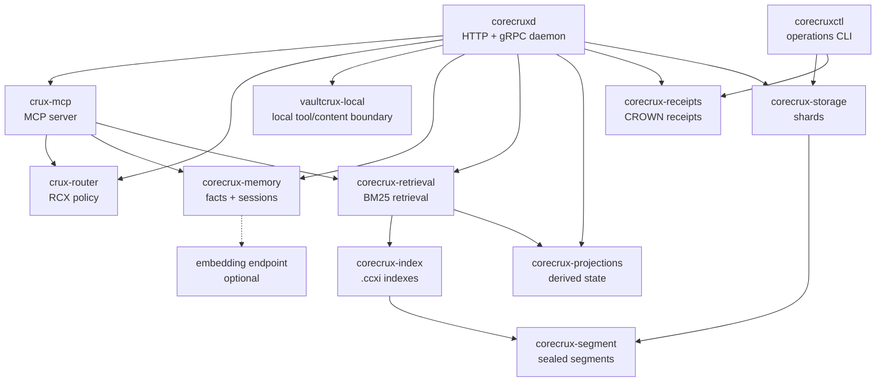

```text
 ██████╗██████╗ ██╗   ██╗██╗  ██╗
██╔════╝██╔══██╗██║   ██║╚██╗██╔╝
██║     ██████╔╝██║   ██║ ╚███╔╝
██║     ██╔══██╗██║   ██║ ██╔██╗
╚██████╗██║  ██║╚██████╔╝██╔╝ ██╗
 ╚═════╝╚═╝  ╚═╝ ╚═════╝╚═╝  ╚═╝
```

# Crux Daemon

[](https://github.com/CueCrux/Crux/actions/workflows/ci.yml)
[](https://github.com/CueCrux/Crux)
[-blue)](LICENCE.md)
[](rust-toolchain.toml)

Crux Daemon is a local-first memory, retrieval, and receipt daemon for agents
and applications. It gives you an HTTP API, a built-in MCP server, append-only
storage, local facts and sessions, BM25 retrieval, CROWN receipts, Prometheus
metrics, and optional bring-your-own embeddings.

The daemon is designed to run cleanly on a laptop, workstation, VM, or container.
It is source-available under the CueCrux Community Licence, but it is not
open-source. Read [Licence](#licence) before redistributing or offering a hosted
service.

## Naming

| Name | Meaning |
|---|---|
| `Crux` | Product and repository name. |
| `Crux Daemon` | The local daemon distribution documented here. |
| `corecruxd` | Canonical daemon binary built by Cargo. |
| `crux` | User-facing release alias for `corecruxd`. |
| `corecruxctl` | CLI for verification, replay, receipts, and operations. |
| `CORECRUXD_*` | Environment-variable prefix for daemon config. |

## What You Get

| Capability | Local daemon | Bring your own | Hosted / managed |
|---|:---:|:---:|:---:|
| Append-only event store with BLAKE3 integrity | yes | | |
| CROWN receipts and receipt verification | yes | | |
| Local fact store | yes | | |
| Local session store | yes | | |
| Built-in MCP server | yes | | |
| Token-filtered local MCP tools | yes | | |
| HTTP, gRPC, health, readiness, and metrics | yes | | |
| `corecruxctl` verification and replay tooling | yes | | |
| BM25 text search with `.ccxi` companion indexes | yes | | |
| Dense fact retrieval via embeddings | | Ollama, vLLM, TEI, llama.cpp, LiteLLM | |
| Hosted team sync, billing, marketplace, credential broker | | | yes |
| GPU/CUDA fused retrieval | | | yes |
| Cross-principal aggregation and hosted Signals | | | yes |

The `/v1/version` response reports which runtime features are active on the
current process.

## Requirements

| Path | Requirements |
|---|---|
| Docker | Docker or Docker Desktop. |
| Build from source | Rust 1.88+, `protobuf-compiler`, and a C toolchain. |
| Shell examples | `curl`; `jq` is recommended for readable JSON. |
| Embeddings | Optional local or remote embedding endpoint. |

## Quickstart

### 1. Start With Docker

```bash
docker compose up -d
```

The compose stack binds HTTP on `127.0.0.1:14800` and MCP on
`127.0.0.1:14801`. Open `http://127.0.0.1:14800` in your browser — the
embedded Crux Console walks you through a one-time setup (auth posture,
health check) and then becomes your local dashboard for facts, packs,
tenants, and posture.

Prefer the command line? Health and version probes:

```bash
curl -sf http://localhost:14800/healthz | jq .
curl -sf http://localhost:14800/readyz | jq .
curl -sf http://localhost:14800/v1/version | jq .
```

#### Live-edit the embedded console (developers only)

To iterate on the console UI without rebuilding the image, start the
optional dev overlay; edits to `crates/corecruxd/playground/index.html`
appear on the next browser refresh:

```bash
docker compose -f docker-compose.yml -f docker-compose.dev.yml up -d
```

### 2. Build From Source

```bash
git clone https://github.com/CueCrux/Crux.git
cd Crux
cargo build --release
CORECRUXD_AUTH_MODE=off CORECRUXD_DATA_DIR=./data ./target/release/corecruxd
```

`CORECRUXD_AUTH_MODE` is required. Use `off` only for local development.

### 3. Install From A Release

Release bundles publish both names:

- `crux-<platform>` for users.
- `corecruxd-<platform>` for service managers and compatibility.

Linux x86_64 example:

```bash
curl -sSL https://github.com/CueCrux/Crux/releases/latest/download/crux-linux-amd64 -o crux
chmod +x crux
CORECRUXD_AUTH_MODE=off CORECRUXD_DATA_DIR=./data ./crux
```

## First Five Minutes

### Store A Fact

The Docker stack defaults to `CORECRUXD_AUTH_MODE=dev_scopes`, so examples
include scope headers. If you started the binary with `CORECRUXD_AUTH_MODE=off`,
you can omit `X-Corecrux-Scopes`.

```bash
curl -s -X PUT http://localhost:14800/v1/facts \
  -H "Content-Type: application/json" \
  -H "X-Corecrux-Scopes: facts:write,facts:read,admin:read" \
  -d '{
    "entity": "project",
    "key": "status",
    "value": "Crux Daemon is running locally",
    "confidence": 0.95
  }' | jq .
```

### Query Facts

```bash
curl -s "http://localhost:14800/v1/facts?query=Crux+Daemon&token_budget=500" \
  -H "X-Corecrux-Scopes: facts:read,admin:read" | jq .
```

### List MCP Tools

```bash
curl -s -X POST http://localhost:14801/mcp \
  -H "Content-Type: application/json" \
  -d '{"jsonrpc":"2.0","id":1,"method":"tools/list"}' \
  | jq '.result.tools[] | {name, description}'
```

The catalogue is token-filtered:

- Local daemon token: local tools only.
- Hosted-authorised token: hosted-gated tools are visible too.
- Tool descriptions are marked with `[local]` or `[hosted]`.

### Verify Store Integrity

```bash
docker exec crux-crux-1 corecruxctl verify-store --data-dir /data --scope recent
```

Fresh data dirs return an empty successful scan. After appends and seals,
`corecruxctl` verifies frame checksums, BLAKE3 hashes, and receipt material.

## Configuration

Crux Daemon supports environment variables and YAML config.

| Config path | Use |
|---|---|
| `config.example.env` | Copy into a shell or service environment. |
| `config.example.yaml` | Copy to `$XDG_CONFIG_HOME/crux/config.yaml`. |
| Environment variables | Override YAML values for service managers. |

Core settings:

| Variable | Default | Description |
|---|---|---|
| `CORECRUXD_AUTH_MODE` | required | `off`, `dev_scopes`, `jwt_hs256`, or `jwt_jwks`. |
| `CORECRUXD_DATA_DIR` | `../CoreCruxData/v1` | Data directory. |
| `CORECRUXD_HTTP_PORT` | `14800` | HTTP API port. |
| `CORECRUXD_GRPC_PORT` | `4007` | gRPC API port. |
| `CORECRUXD_MCP_PORT` | `14801` | MCP server port. |
| `CORECRUXD_MCP_ENABLED` | `true` | Enable the built-in MCP server. |
| `CORECRUXD_BUILD_CCXI` | `0` | Build `.ccxi` indexes at seal time. |
| `CORECRUXD_EMBEDDING_URL` | unset | Enables dense fact retrieval. |
| `CORECRUXD_EMBEDDING_MODEL` | `nomic-embed-text` | Embedding model name. |

Security defaults:

- Loopback binds are safe for local development.
- Non-loopback HTTP binds require a real auth mode unless explicitly overridden.
- Non-loopback MCP binds should set `CRUX_AGENT_TOKEN` or `CRUX_AGENT_TOKENS`.
- Set `CRUX_MCP_HANDOFF_SECRET` if handoff packages must survive restarts.

## Authentication Modes

| Mode | Use case |
|---|---|
| `off` | Local development only. |
| `dev_scopes` | Tests and local demos using `X-Corecrux-Scopes`. |
| `jwt_hs256` | Small deployments with shared-secret JWTs. |
| `jwt_jwks` | Production-style OIDC/JWKS verification. |

The daemon refuses to start unless `CORECRUXD_AUTH_MODE` is explicit.

## Embeddings

Crux Daemon does not ship an embedding model. Point it at an endpoint you
control:

```bash
CORECRUXD_EMBEDDING_URL=http://localhost:11434
CORECRUXD_EMBEDDING_MODEL=nomic-embed-text
```

Supported patterns:

| Provider | Notes |
|---|---|
| Ollama | Easy local setup; CPU, NVIDIA, AMD, and Apple Silicon. |
| vLLM | Good for NVIDIA deployments. |
| TEI | Hugging Face Text Embeddings Inference. |
| llama.cpp | Broad hardware support. |
| LiteLLM | Proxy to other providers. |

When embeddings are unset, fact queries use keyword matching and confidence
ranking only.

## MCP Server For Agents

The MCP server is available at `http://localhost:14801/mcp`.

Connectors:

- Claude Desktop / Claude Code: use `examples/mcp-configs/claude-desktop.json`.
- Cursor: use `examples/mcp-configs/cursor.json`.
- See `examples/mcp-configs/README.md` for platform-specific paths.

Recommended first calls:

1. `cuecrux_session` - get the typed capability plan.
2. `get_bootstrap(topic="patterns")` - learn current agent patterns.
3. `store_fact(entity="test", key="hello", value="world")`.
4. `query_facts(query="hello")`.
5. `update_status()` before upgrades.

For agent guidance, see `docs/agent-guide.md`.

## HTTP API

Common endpoints:

| Method | Path | Purpose |
|---|---|---|
| `GET` | `/healthz` | Process health. |
| `GET` | `/readyz` | Serving readiness. |
| `GET` | `/metrics` | Prometheus metrics. |
| `GET` | `/v1/version` | Build, features, sync, and update state. |
| `PUT` | `/v1/facts` | Store a fact. |
| `GET` | `/v1/facts` | Query facts. |
| `POST` | `/v1/admin/append` | Append events. |
| `POST` | `/v1/query/text-search` | BM25 text retrieval. |
| `POST` | `/v1/query/graph-expand` | Graph expansion where dataplane support exists. |
| `GET` | `/v1/receipts/{id}` | Fetch a receipt. |
| `GET` | `/v1/receipts/{id}/verification` | Verify a receipt. |

Full route notes live in `docs/api-reference.md`.

## CLI

`corecruxctl` is the operations companion.

| Command | Purpose |
|---|---|
| `verify-store` | Check data-dir integrity. |
| `replay` | Replay logs and classify drift. |
| `receipts` | Inspect and export receipts. |
| `ccxi` | Inspect companion indexes. |
| `projections` | Inspect projection state. |

Run:

```bash
./target/release/corecruxctl --help
```

## Backups And Upgrades

Before upgrading:

1. Stop the daemon cleanly.
2. Snapshot or copy `CORECRUXD_DATA_DIR`.
3. Run `corecruxctl verify-store --data-dir <dir> --scope recent`.
4. Keep the previous binary until the new one passes `/readyz`.
5. Check `update_status()` or `/v1/version.update`.

Rollback is restoring the data-dir snapshot and restarting the previous binary.
Do not delete live shard data by hand.

Agents can retrieve upgrade and backup playbooks with:

- `get_bootstrap(topic="docs", query="upgrade")`
- `get_bootstrap(topic="docs", query="backup")`

## Release Packages

Release bundles are built with `scripts/package-daemon-release.sh` and include:

- `corecruxd-<platform>`
- `crux-<platform>`
- `corecruxctl-<platform>`
- `LICENCE-CODE.md`
- `LICENCE-CONTENT.md`
- `TRUST-CONTRACT.md`
- `config.example.env`
- `config.example.yaml`
- `content/MANIFEST.json`
- `content/README.md`
- `docs/release-packaging.md`
- `RELEASE-MANIFEST-<platform>.txt`

See `docs/release-packaging.md`.

## Troubleshooting

Fast checks:

```bash
curl -sf http://localhost:14800/healthz | jq .
curl -sf http://localhost:14800/readyz | jq .
curl -sf http://localhost:14800/metrics | head
curl -s http://localhost:14800/v1/version | jq .
```

Common fixes:

| Symptom | Check |
|---|---|
| Daemon exits at startup | Set `CORECRUXD_AUTH_MODE`. |
| HTTP works but MCP does not | Check `CORECRUXD_MCP_ENABLED` and port `14801`. |
| Non-loopback bind refused | Use `jwt_hs256` or `jwt_jwks`, or keep loopback. |
| Text search has no results | Enable `.ccxi` build and ensure sealed/indexed data exists. |
| Embeddings are inactive | Set `CORECRUXD_EMBEDDING_URL` and model. |
| Store verification fails | Stop the daemon, snapshot data, then inspect with `corecruxctl`. |

More detail: `docs/troubleshooting.md`, `docs/ops-guide.md`, and
`docs/agent-guide.md`.

## Architecture



More detail: `docs/architecture.md`.

## Licence

Crux Daemon is source-available under the
[CueCrux Community Licence (CCL v1.0)](LICENCE.md).

- Internal commercial use is permitted.
- Reading, auditing, and internal modification are permitted.
- Offering Crux as a competing managed service is prohibited.
- Three years after each versioned release, the code converts to Apache 2.0.
- Curated content is covered separately by `LICENCE-CONTENT.md`.

Copyright (c) 2026 CueCrux Ltd. All rights reserved.
