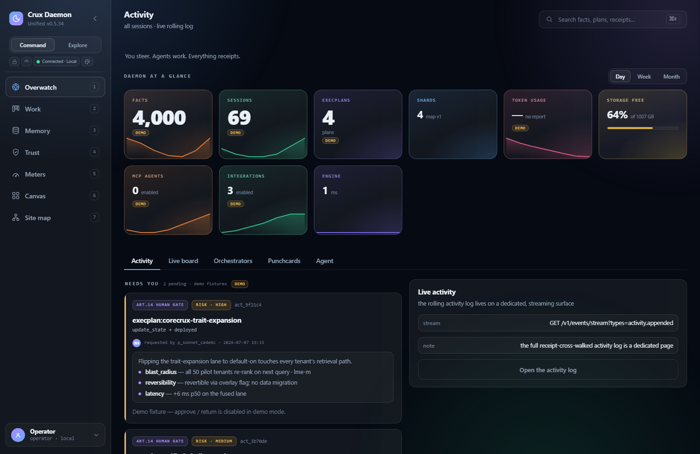
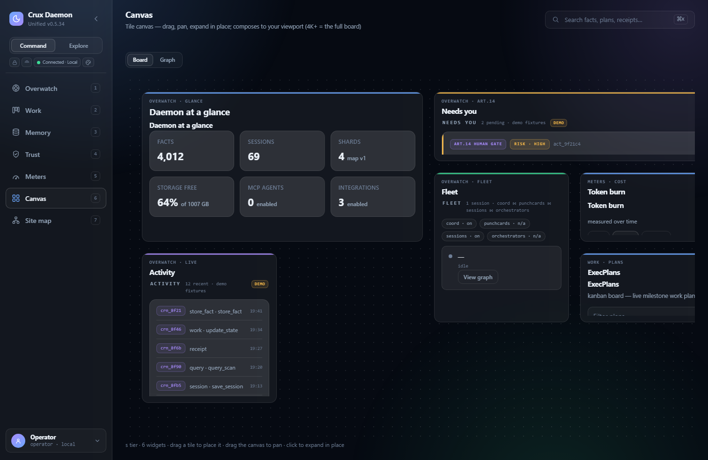
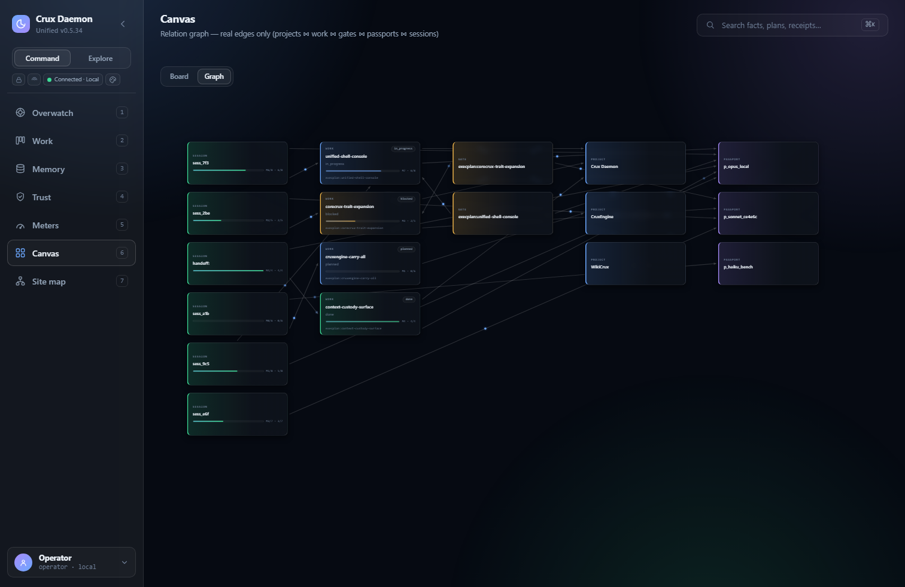
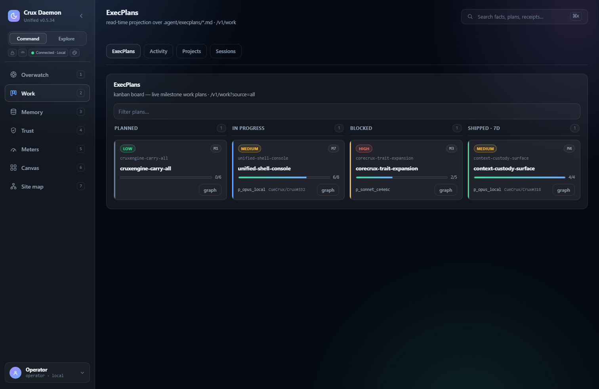
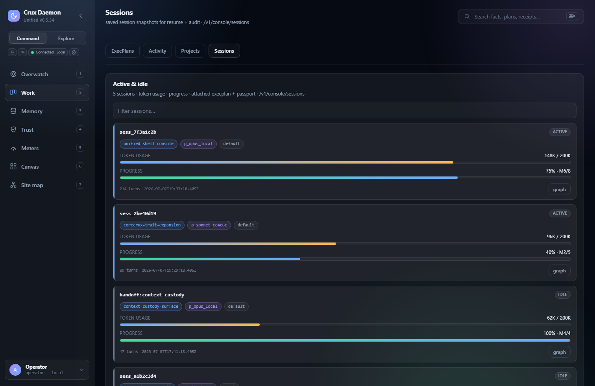
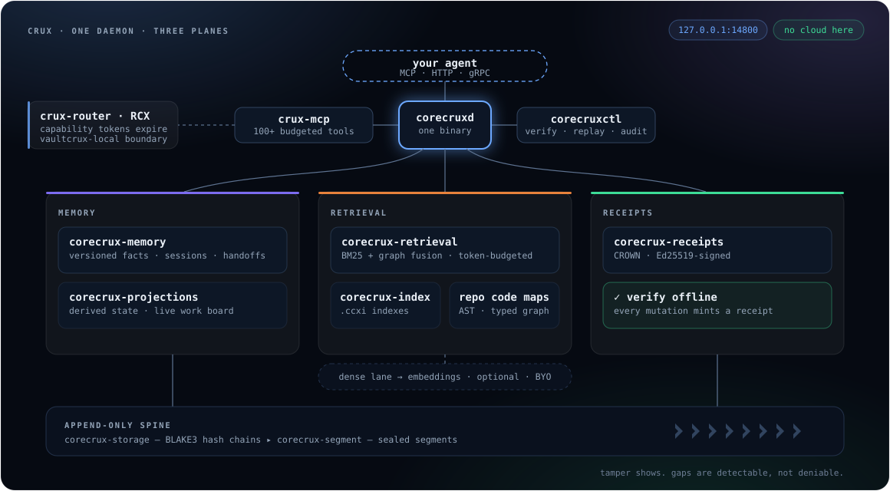
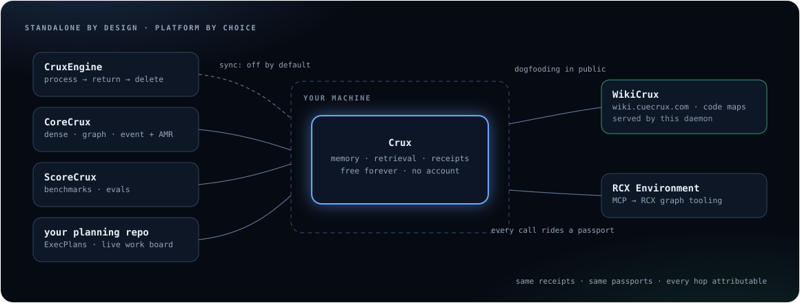

<div align="center">

<picture>
  <source media="(prefers-color-scheme: dark)" srcset="docs/Images/readme/CueCrux-Arc-Loop-White.png">
  
</picture>
<br /><br />
<picture>
  <source media="(prefers-color-scheme: dark)" srcset="docs/Images/readme/crux-dark.svg">
  
</picture>

### One binary. Your whole memory.

**Crux is a local-first memory daemon for AI agents** — a versioned fact store, token-budgeted
BM25 + graph retrieval, and an Ed25519-signed receipt for every write. 100+ MCP tools, agent
passports, portable `.cruxpack` export. No account. No API keys. Nothing leaves your machine.

[**Up and running in 60 seconds**](#up-and-running-in-60-seconds) ·
[The console](#the-console) · [How it works](#how-it-works) ·
[MCP tools](#100-mcp-tools-memory-first) ·
[Platform](#standalone-by-design-platform-by-choice) · [Docs](docs/README.md)

[](https://github.com/CueCrux/Crux/actions/workflows/ci.yml)
[](https://github.com/CueCrux/Crux/actions/workflows/coverage-attestation.yml)
[](#100-mcp-tools-memory-first)
[-blue)](LICENCE.md)



<sub><b>Overwatch</b> — the gates that need you, the live fleet, every action receipted.
Ships inside the daemon at <code>localhost:14800</code> — no account, no cloud dashboard.</sub>

</div>

## Why Crux

- **Memory that ages honestly.** Facts carry confidence, provenance and a freshness horizon
  (volatile ~24 h · medium ~35 d · stable ~1 y). A deterministic decay engine downranks stale
  claims instead of serving them as truth — reversible via `memory_reverify`, with scoped
  forget + dry-run for GDPR Art. 17.
- **Retrieval on a token budget.** `token_budget` is a first-class parameter, not a hope.
  BM25 + graph fusion returns metadata and token counts first, content only inside budget —
  **60–80% fewer tokens** than naive top-K context stuffing. Dense lanes are bring-your-own
  and never required.
- **Receipts, not vibes.** Every mutation emits a **CROWN receipt**: Ed25519-signed,
  hash-bound, independently verifiable offline. Store integrity is checked separately with
  `corecruxctl verify-store --strict`.
- **Identity agents earn.** Every agent carries a passport with a five-tier reputation ladder;
  verified receipts accrue as track record, and capability tokens expire instead of leaking.
- **Policy over memory.** Declare organisational constraints once; proposed actions are checked
  against them — pass, warn, or block — before they execute.
- **Your memory follows you.** Export everything as a self-certifying `.cruxpack` — signed,
  offline-verifiable, importable into any other daemon. Leaving is a command, not a ticket.
- **Know what every session cost.** `corecruxctl session cost` and the console's token-burn
  page show how much context every model call re-read, where it went, and what to change.

## Up and running in 60 seconds

The lowest-friction install is to just ask your agent. Paste this into any coding agent —
it reviews the source, installs and runs the daemon, then Crux's setup wizard wires it into
your session: the MCP surface connected, a passport minted, a first fact round-tripped.

```text
Review and install the Crux Daemon from github.com/CueCrux/Crux — read the README and
LICENCE first, run it locally, then use its setup wizard to connect the daemon to this
session and confirm the console is up at http://localhost:14800.
```

**Prefer to do it yourself?** Bring the daemon up on any of three rails:

```bash
# Docker (recommended)
git clone https://github.com/CueCrux/Crux.git && cd Crux
docker compose up -d
```

<details>
<summary>From a release binary, or from source</summary>

**From a release** (binaries are cosign-signed with SBOMs — [verify them](docs/verify-release.md)):

```bash
curl -sSL https://github.com/CueCrux/Crux/releases/latest/download/crux-linux-amd64 -o crux
chmod +x crux
CORECRUXD_AUTH_MODE=dev_scopes CORECRUXD_DATA_DIR=./data ./crux
```

**From source** (Rust 1.88+, `protobuf-compiler`):

```bash
git clone https://github.com/CueCrux/Crux.git && cd Crux
cargo build --release
CORECRUXD_AUTH_MODE=dev_scopes CORECRUXD_DATA_DIR=./data ./target/release/corecruxd
```

`CORECRUXD_AUTH_MODE` is required; `dev_scopes` is the single-user loopback quickstart rail.
Use `off` only for throwaway local development.
</details>

HTTP binds `127.0.0.1:14800`, MCP binds `127.0.0.1:14801`. Open `http://127.0.0.1:14800` —
the embedded console walks you through one-time setup — then get live with one command:

```bash
corecruxctl start
```

`start` is the canonical on-ramp: it detects the daemon, authenticates on the lowest-friction
secure rail, wires the MCP endpoint + Claude Code hooks, round-trips a first fact, and prints a
single "you're live" summary. Longer install path: [docs/getting-started.md](docs/getting-started.md) ·
guided rails: `corecruxctl login`, `corecruxctl quickstart` · ready-made MCP connector configs
for Claude Code, Claude Desktop and Cursor: [`examples/mcp-configs/`](examples/mcp-configs/).

> [!NOTE]
> Crux receipts and BLAKE3 chains prove **integrity, not confidentiality**. The daemon data
> directory is not encrypted by Crux; use filesystem encryption (LUKS, FileVault, BitLocker)
> when the machine, volume, or backup location is outside your trusted boundary. Per-event-class
> assurance (what is captured, what can bypass capture, what a receipt does and does not prove):
> [docs/assurance-coverage-matrix.md](docs/assurance-coverage-matrix.md).

## The console

Every daemon ships a local operator console at `localhost:14800` — watch your fleet, your
plans, and your memory, every action receipted.

<table>
  <tr>
    <td width="50%"></td>
    <td width="50%"></td>
  </tr>
  <tr>
    <td align="center"><sub><b>Canvas</b> — your whole operation as a size-adaptive board</sub></td>
    <td align="center"><sub><b>the relation graph</b> — sessions, work, gates and passports, flow-traced</sub></td>
  </tr>
  <tr>
    <td width="50%"></td>
    <td width="50%"></td>
  </tr>
  <tr>
    <td align="center"><sub><b>plans as living documents</b> — milestones, gates, risk, progress</sub></td>
    <td align="center"><sub><b>sessions that survive restarts</b> — resume, audit, attribute token spend</sub></td>
  </tr>
</table>

## Don't believe this README

Every claim about integrity is checkable on your own machine, offline, in about 60 seconds:

```bash
git clone https://github.com/CueCrux/Crux.git && cd Crux
cargo build --release --bin corecruxctl
bash scripts/demo-receipt-tamper.sh
```

The script seeds a CROWN receipt into a tmp data dir, runs `corecruxctl verify-store --mode full
--strict` (expects `ok: true`), **flips one byte on disk**, re-runs verification, and asserts the
failure is detected. Read the script first — it's ~150 lines of bash using only documented
subcommands.

The verifier is ~1,250 lines of Rust at
[`crates/corecrux-receipts/src/verify_v1.rs`](crates/corecrux-receipts/src/verify_v1.rs):
`ed25519-dalek::verify_strict` (rejects malleable signatures and small-order keys), with the
signature bound to both receipt ID and payload hash so it can't be transplanted. Tamper tests
live in [`crates/corecrux-receipts/src/tests.rs`](crates/corecrux-receipts/src/tests.rs).

And you can run **the same exit test we run in CI** — export everything the daemon knows (facts +
sessions) and everything it did (signed journal + receipt refs) into one passport-signed bundle,
verify that bundle **offline**, and watch the verifier reject a tampered byte:

```bash
corecruxctl context export --data-dir <dir> --out ./bundle   # signed=true
corecruxctl context verify ./bundle --json                   # ok=true, offline, no network
```

There is no lock-in: the answer to *"can you export it?"* and *"can you prove what it saw and
did?"* is a command, not a support ticket. This export → offline-verify → tamper-rejection cycle
is a release-blocking CI gate, so every published build has passed its own exit test. Release
artifacts are signed and attested end-to-end — cosign keyless signatures, CycloneDX SBOMs, SLSA
provenance ([docs/verify-release.md](docs/verify-release.md)). Found something?
Report it privately per the [security policy](SECURITY.md).

<div align="center">


<sub><b>receipts as a literal chain</b> — click any block in the console, inspect the proof</sub>
</div>

**Testing & coverage:** 5,000+ tests and **~87%** CI-gated region coverage, with per-crate floors
on the trust core (`corecrux-receipts` / `-segment` / `-storage`) and the ungated total reported
alongside so exclusions can't hide low-coverage code. How it's measured and exactly what's
excluded: [docs/testing-and-coverage.md](docs/testing-and-coverage.md).

## Your context window is the scarce resource

Most memory layers measure recall. Crux also measures what recall *costs*: every retrieval call
takes a hard `token_budget`, and the daemon trims to fit — metadata first, content only when it
earns its tokens.


All daemon numbers are reproducible from [`docs/benchmarks.md`](docs/benchmarks.md) with pinned
baselines, regression-gated in CI. ScoreCrux methodology, negative controls and per-model runs:
[scorecrux.com/context](https://scorecrux.com/context) · [scorecrux.com/scale](https://scorecrux.com/scale).
Early hosted-retrieval evals via the CoreCrux substrate score ~91% under strict scoring¹.

<sub>¹ Internal runs via the CoreCrux retrieval substrate (paid tier; see
[the platform section](#standalone-by-design-platform-by-choice)), not the bare local daemon.
Strict scoring, no partial credit. Treat this as preliminary until a public evidence pack with
corpus, run ID, lane flags, and commit SHA is published.</sub>

## How it works

One daemon, three planes — memory, retrieval, receipts — on an append-only spine. The colours
are the console's own: violet for memory, amber for retrieval, mint for receipts. No cloud in
this picture; that's the point.



More detail: [`docs/architecture.md`](docs/architecture.md).

## Passports, and how the line is drawn

API keys say *something with this string called us*. A passport says *this agent, at this trust
tier, with these grants, made this call* — identity and constraint, receipted as a verifiable
record. What a receipt proves (and what it deliberately does not) is spelled out per event class
in the [assurance & coverage matrix](docs/assurance-coverage-matrix.md); forgery-resistant
*evidence* of model traffic comes from the [mediated witness path](docs/llm-shim.md), whose key
the agent never holds.

1. **Bind** — the session handshake binds every connection to a passport. No anonymous writes;
   unattributed calls are operator-tagged, never silently allowed.
2. **Carry** — every tool call rides the passport. RCX mints short-lived capability tokens
   against it — scoped to tools, tenant and tier — so access expires instead of leaking.
3. **Earn** — verified receipts accrue to the passport as reputation; five tiers climb the
   capability ladder and unlock more autonomy. Trust is a ledger, not a checkbox.
4. **Answer** — any receipt, any time later, resolves back to the passport that produced it:
   who acted, at what tier, under which grants.

The same daemon binary runs on every tier. What changes is a signed **RCX capability token** —
the policy layer that says which backends the daemon may call and what data may cross the wire.
**Enforcement is a property of the wire, not a crippled binary.** Tokens are self-issued locally,
verifiable offline with the same machinery as everything else, and refusals are fail-closed with
a signed `RefusalReceipt` carrying a reason code — never a bare 403 or a silent downgrade.

## What you get

| Capability | Local daemon | Bring your own | Hosted / managed |
|---|:---:|:---:|:---:|
| Append-only event store with BLAKE3 integrity | yes | | |
| CROWN receipts and offline receipt verification | yes | | |
| Versioned fact store with freshness decay + `memory_reverify` | yes | | |
| Scoped forget with dry-run (GDPR Art. 17) | yes | | |
| Sessions, checkpoints and cross-session handoffs | yes | | |
| ExecPlans + live work board | yes | | |
| Decision records + constraint governance | yes | | |
| `.cruxpack` export + offline import | yes | | |
| Built-in MCP server, 100+ token-filtered tools | yes | | |
| Agent passports (five-tier reputation) + RCX capability tokens | yes | | |
| Live multi-session coordination board | yes | | |
| Typed action traces (reasoning refs — never raw CoT) | yes·flag | | |
| C2PA output attestation | yes·flag | | |
| HTTP, gRPC, health, readiness, and metrics | yes | | |
| `corecruxctl` verification and replay tooling | yes | | |
| BM25 text search with `.ccxi` companion indexes | yes | | |
| AST code maps: register a repo, get a typed code-structure graph (Rust · TS · Python · Vue) | yes | | |
| Dense fact retrieval via embeddings | | Ollama, vLLM, TEI, llama.cpp, LiteLLM | |
| Hosted team sync, multi-device passports, billing | | | yes |
| GPU/CUDA fused retrieval + AMR routing | | | yes |
| LLM entity/relation extraction + better-dense rerank | | | yes |
| Fleet governance: attribution, policy gates, revocation | | | yes |

`yes·flag` = ships in this repo behind a default-off feature flag — your traces and attestations
are opt-in, like everything else. `/v1/version` reports which features are active.

## Standalone by design, platform by choice

Crux is complete on its own. When you want more, it's the memory spine of the CueCrux platform —
same receipts, same passports, every hop attributable.



**Free forever** — the full local daemon: receipts, retrieval, passports, console. **Pro**
(£19/user·mo) adds hosted sync, multi-device passports, and better-dense rerank. **Governance**
(£49/user·mo) adds fleet-wide attribution, policy gates, and revocation that propagates with
proof. Metered **credits** (~£0.01/Cr) buy the heavy lifts — dense rerank, extraction,
attestations. The local dense lane is **never** metered: credits buy the step-up, not your own
machine. Every credit spend mints a signed receipt (`crux.credit_spend_receipt.v1`) — even the
meter is auditable. The local daemon is the acquisition, not the upsell.
Full ladder: [memorycrux.com/pricing](https://memorycrux.com/pricing).

**You cannot pay us to hold your data — there is no such product.** Paid frontier ingest and
extraction is processed in flight, never parked: enrichment lands back in *your* store —
process, return, delete. Every hop carries a receipt. Local-first isn't a pricing tier; it's
the architecture. The promises are written down in the [Trust Contract](TRUST-CONTRACT.md).

**The lane stack** (each lane is a different way of remembering):

| Lane | What it remembers | Tier |
|---|---|---|
| lexical | exact words, BM25-class — microseconds on CPU | free · local |
| dense | semantic similarity — meaning, not spelling | BYOE / managed |
| graph / topology | entity links walked at query time | CoreCrux |
| entity & trait | who/what-keyed recall — ask about a person, get their dossier | CoreCrux |
| event | time-anchored recall — what happened, when, in what order | CoreCrux |
| navigational | summary-tree descent for corpora too large to scan | CoreCrux |
| verbatim pointers | exact-quote recall without duplicating content | free · local |
| *+ several more* | *the ones we don't blog about* | — |

**AMR — Adaptive Manifest Routing** reads the lane manifest and routes each query automatically —
fusing the lanes that earn their tokens, skipping the ones that don't, learning from per-request
outcomes. No knobs. It switches on with a subscription and stays off otherwise. Without one you
still run the full local daemon — lexical lane, graph fusion, token budgets, receipts. That's not
a demo; it's the same engine the paid lanes plug into.

## EU AI Act

The Act asks for risk management, logging, transparency and human oversight. Most stacks will
answer with PDFs. Crux answers with receipts — the compliance machinery is the same machinery
everything else runs on.

| Article | The Act asks for | Crux gives you |
|---|---|---|
| **Art. 9** — risk management | documented risk processes | risk classes on plans/work items; high-risk transitions demand a passport-attributed human gate, and the gate becomes a signed fact |
| **Art. 10** — data governance | PII discipline | private facts never leave the machine; reserved prefixes are private at ingest; observation capture redacts; reasoning stored as references, never raw chain-of-thought |
| **Art. 12** — record-keeping | automatic logging | every state mutation emits a signed CROWN receipt + timeline row; hash-chained, so gaps are detectable, not deniable |
| **Art. 13** — transparency | attributable outputs | agent passports attribute every mutation; AI-authored commits and PRs carry agent attribution |
| **Art. 14** — human oversight | meaningful gates | destructive actions need explicit, current consent; gated transitions can't auto-approve past a timeout |
| **Art. 15** — accuracy & robustness | foresight + integrity | consequence enrichment before high-risk operations; published benchmark packs carry corpus + commit; tamper-evident store |
| **Art. 50** — output transparency | "an AI made this" | C2PA Content Credentials via `output_attest` — a verifiable claim, not a footer |
| *GDPR Art. 17* — erasure | right to be forgotten | `memory_forget` with dry-run: see what would be deleted, then delete it auditably |

> These are engineering controls aligned with the Act — not a legal opinion, and conformity
> assessment for your deployment remains your responsibility. What Crux gives you is the evidence
> layer: when the auditor asks, you answer with receipts, not screenshots.

## Engrams — memory that compiles

Retrieval answers questions. Engrams skip them. When the same lesson keeps getting re-learned from
raw history, it's distilled into a named, versioned procedure that arrives **before** the agent
acts — instinct, not search. Engrams carry provenance hashes back to the source chunks they were
learned from (you can always audit *why* the instinct exists), resolve by declared intent at
session start, and are gated by passport tier. Local-first: a built-in catalog plus fact-backed
overlays serve the same contract with zero cloud dependency.

## 100+ MCP tools, memory-first

Built MCP-first, not MCP-wrapped: every retrieval tool takes a token budget, every mutation emits
a receipt, identity rides a passport. The server lives at `http://localhost:14801/mcp`.

> [!TIP]
> **AI agents exploring this codebase: start at [`AGENTS.md`](AGENTS.md)** — a crate atlas,
> a claims-to-code-to-tests matrix, and the cryptographic invariants, all anchored by
> greppable symbol names and verified in CI.

| Capability area | Representative tools |
|---|---|
| Memory & retrieval | `store_fact` · `query_facts` · `query` · `query_scan` · `query_expand` · `fact_history` · `memory_view` · `get_bootstrap` |
| Freshness & consolidation | `memory_freshness` · `memory_contradictions` · `memory_consolidate` · `memory_reverify` · `memory_pin` |
| Portability & erasure | `memory_forget` · `memory_forget_dry_run` · `output_attest` · `receipt_verify` |
| Identity & passports | `issue_passport` · `get_passport` · `revoke_passport` · `passport_link_device` · `resolve_principal` |
| Handoff, sync & coordination | `create_handoff` · `accept_handoff` · `sync_status` · `coord_status` · `coord_announce` |
| Sessions & artefacts | `save_session` · `get_session` · `session_checkpoint` · `list_sessions` · `artefact_put` · `artefact_get` |
| Decisions & constraints | `record_decision` · `declare_constraint` · `get_constraints` · `check_constraints` |
| Observability | `list_observations` · `get_observation` · `verify_observation` · `session_token_usage` |

…and more across substrate entities & edges, work & coordination, and orchestration — 100+
tools today, and counting. The catalogue is token-filtered: a local token sees local tools;
hosted-authorised tokens also see hosted-gated tools (descriptions are marked `[local]` /
`[hosted]`).

Recommended first calls: `cuecrux_session` → `get_bootstrap(topic="patterns")` →
`store_fact(...)` → `query_facts(...)`. Full guidance: [`docs/agent-guide.md`](docs/agent-guide.md) ·
API surface: [`docs/developer-portal.md`](docs/developer-portal.md).

## Operations reference

<details>
<summary><b>Requirements & configuration</b></summary>

| Path | Requirements |
|---|---|
| Docker | Docker or Docker Desktop. |
| Build from source | Rust 1.88+, `protobuf-compiler`, and a C toolchain. |
| Shell examples | `curl`; `jq` recommended. |
| Embeddings | Optional local or remote embedding endpoint. |

Config via environment variables or YAML (`config.example.env`, `config.example.yaml` →
`$XDG_CONFIG_HOME/crux/config.yaml`). Core settings:

| Variable | Default | Description |
|---|---|---|
| `CORECRUXD_AUTH_MODE` | required | `off`, `dev_scopes`, `jwt_hs256`, or `jwt_jwks`. |
| `CORECRUXD_DATA_DIR` | `../CoreCruxData/v1` | Data directory. |
| `CORECRUXD_HTTP_PORT` | `14800` | HTTP API port. |
| `CORECRUXD_GRPC_PORT` | `4007` | gRPC API port. |
| `CORECRUXD_MCP_PORT` | `14801` | MCP server port. |
| `CORECRUXD_MCP_ENABLED` | `true` | Enable the built-in MCP server. |
| `CORECRUXD_BUILD_CCXI` | `0` | Build `.ccxi` indexes at seal time. |
| `CORECRUXD_CREDIT_METER` | `false` | Enable the default-off comped-wallet credit meter and `/v1/credits/spend` test rail. |
| `CORECRUXD_EMBEDDING_URL` | unset | Enables dense fact retrieval. |
| `CORECRUXD_EMBEDDING_MODEL` | `nomic-embed-text` | Embedding model name. |
| `CORECRUXD_CORECRUX_BASE_URL` | unset | CoreCrux admin base URL for `/console` lane-weight controls. |
| `CORECRUXD_CORECRUX_ADMIN_TOKEN` | unset | Optional bearer token forwarded to CoreCrux admin endpoints. |
| `CORECRUXD_CORECRUX_PASSPORT_ID` | unset | Optional passport id forwarded to CoreCrux admin endpoints. |

Security defaults: loopback binds are safe for local development; non-loopback HTTP binds require
a real auth mode; non-loopback MCP binds should set `CRUX_AGENT_TOKEN(S)`; set
`CRUX_MCP_HANDOFF_SECRET` if handoff packages must survive restarts. The daemon refuses to start
unless `CORECRUXD_AUTH_MODE` is explicit (`off` | `dev_scopes` | `jwt_hs256` | `jwt_jwks`).

Usage receipts (adoption signal) are **opt-in and off by default** — the daemon sends no outbound
signal unless you set an `https://` collector endpoint *and* record consent. See
[`docs/usage-receipts.md`](docs/usage-receipts.md) (`CORECRUXD_USAGE_RECEIPTS_SUBMIT` /
`_ENDPOINT` / `_CONSENT_AT`).

Credit Meter is also **opt-in and off by default**. `CORECRUXD_CREDIT_METER=1` enables only the
seeded comped-wallet spend rail for pinned quotes and signed spend receipts; fiat minting, Paddle,
and production billing remain separately gated. The same flag meters successful RCX-verified
`/v1/gpu1/rerank` compute: callers carry the pinned quote in `options.credit_quote`, and the result
adds the spend receipt id, credits spent, and post-spend wallet balance.

</details>

<details>
<summary><b>First five minutes (HTTP API)</b></summary>

Store a fact (Docker default is `dev_scopes`, hence the scope header):

```bash
curl -s -X PUT http://localhost:14800/v1/facts \
  -H "Content-Type: application/json" \
  -H "X-Corecrux-Scopes: facts:write,facts:read,admin:read" \
  -d '{"entity":"project","key":"status","value":"Crux Daemon is running locally","confidence":0.95}' | jq .
```

Query facts (note the mandatory-by-convention token budget):

```bash
curl -s "http://localhost:14800/v1/facts?query=Crux+Daemon&token_budget=500" \
  -H "X-Corecrux-Scopes: facts:read,admin:read" | jq .
```

Verify store integrity:

```bash
docker exec crux-crux-1 corecruxctl verify-store --data-dir /data --scope recent
docker exec crux-crux-1 corecruxctl verify-store --data-dir /data --scope all --mode full --strict
```

Common endpoints:

| Method | Path | Purpose |
|---|---|---|
| `GET` | `/healthz` / `/readyz` / `/metrics` | health, readiness, Prometheus |
| `GET` | `/v1/version` | build, features, sync, update state |
| `PUT` / `GET` | `/v1/facts` | store / query facts |
| `POST` | `/v1/admin/append` | append events |
| `POST` | `/v1/query/text-search` | BM25 retrieval |
| `GET` | `/v1/receipts/{id}` / `…/verification` | fetch / verify a receipt |

Full route notes: [`docs/api-reference.md`](docs/api-reference.md).

</details>

<details>
<summary><b>Embeddings (bring your own)</b></summary>

Crux ships no embedding model. Point it at an endpoint you control:

```bash
CORECRUXD_EMBEDDING_URL=http://localhost:11434
CORECRUXD_EMBEDDING_MODEL=nomic-embed-text
```

Supported patterns: Ollama, vLLM, TEI, llama.cpp, LiteLLM. When unset, fact queries use keyword
matching and confidence ranking only.

</details>

<details>
<summary><b>CLI, backups, upgrades, troubleshooting</b></summary>

`corecruxctl` subcommands: `verify-store` (integrity), `replay` (drift classification),
`receipts` (inspect/export), `ccxi` (companion indexes), `projections` (projection state).

Before upgrading: stop cleanly → snapshot `CORECRUXD_DATA_DIR` → `corecruxctl verify-store
--scope recent` plus `corecruxctl verify-store --scope all --mode full --strict` when the window
allows → keep the previous binary until the new one passes `/readyz`. Rollback = restore
the snapshot, restart the previous binary. Never delete live shard data by hand.

| Symptom | Check |
|---|---|
| Daemon exits at startup | Set `CORECRUXD_AUTH_MODE`. |
| HTTP works but MCP doesn't | `CORECRUXD_MCP_ENABLED`, port `14801`. |
| Non-loopback bind refused | Use `jwt_hs256` / `jwt_jwks`, or stay loopback. |
| Text search empty | Enable `.ccxi` build; ensure sealed/indexed data exists. |
| Embeddings inactive | Set `CORECRUXD_EMBEDDING_URL` + model. |
| Store verification fails | Stop daemon, snapshot data, inspect with `corecruxctl`. |

More: [`docs/troubleshooting.md`](docs/troubleshooting.md) ·
[`docs/ops-guide.md`](docs/ops-guide.md) · [`docs/release-packaging.md`](docs/release-packaging.md)

</details>

<details>
<summary><b>Naming & repository scope</b></summary>

| Name | Meaning |
|---|---|
| `Crux` | Product and repository name. |
| `Crux Daemon` | The local daemon distribution documented here. |
| `corecruxd` | Canonical daemon binary built by Cargo. |
| `crux` | User-facing release alias for `corecruxd`. |
| `corecruxctl` | CLI for verification, replay, receipts, and operations. |
| `CORECRUXD_*` | Environment-variable prefix for daemon config. |

**This repo contains** the local-first daemon, CLI, MCP server, append-only storage, BM25
retrieval, CROWN receipt verification, capability-token signing/verification, the outbox-push
sync client, and the Claude Code lifecycle hooks. Every claim about *local* trust can be verified
by reading this tree.

**This repo does not contain** the hosted backend (operated by CueCrux Ltd) or GPU/CUDA
acceleration (a separate distribution; this repo is CPU-only). Self-hosting without the hosted
backend keeps the daemon fully functional in local-only mode (`crux-router` returns
`DegradedLocal` for hosted-tier decisions). This boundary is intentional — audit the local half
here, the hosted half via the published Trust Contract and the receipts your daemon emits.

</details>

## Community

Built in the open, verified in the open. If Crux is useful to you, a star helps others find it.

[Contributing](CONTRIBUTING.md) · [Security policy](SECURITY.md) ·
[Code of conduct](CODE_OF_CONDUCT.md) · [Changelog](CHANGELOG.md) ·
[Trust Contract](TRUST-CONTRACT.md)

- Before running a release artifact, verify its signature, SBOM and provenance with
  [`docs/verify-release.md`](docs/verify-release.md).
- Report vulnerabilities privately through [`SECURITY.md`](SECURITY.md); do not open a public
  issue for security bugs.
- For non-security bugs or feature requests, use the GitHub issue templates:
  [bug report](.github/ISSUE_TEMPLATE/bug_report.yml) or
  [feature request](.github/ISSUE_TEMPLATE/feature_request.yml).

## Licence

Crux Daemon is source-available under the
[CueCrux Community Licence (CCL v1.0)](LICENCE.md).

- Internal commercial use is permitted.
- Reading, auditing, and internal modification are permitted.
- Offering Crux as a managed, hosted, or cloud service to third parties is prohibited.
- **Three years after each versioned release, the code converts to Apache 2.0.**
- Curated content is covered separately by [`content/LICENCE-CONTENT.md`](content/LICENCE-CONTENT.md).
- Plain-English answers: [`docs/LICENCE-FAQ.md`](docs/LICENCE-FAQ.md).

Copyright (c) 2026 CueCrux Ltd. All rights reserved.
