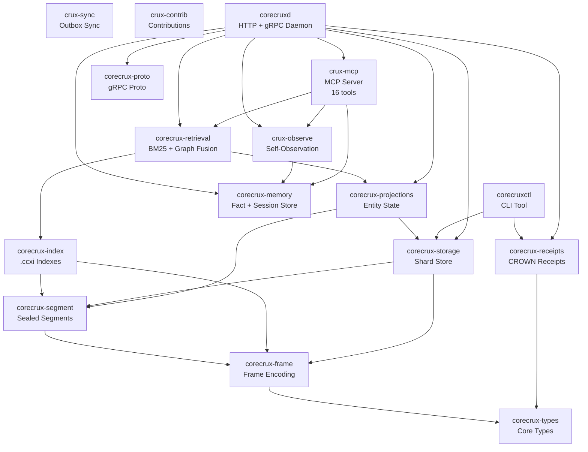

```
 ██████╗██████╗ ██╗   ██╗██╗  ██╗
██╔════╝██╔══██╗██║   ██║╚██╗██╔╝
██║     ██████╔╝██║   ██║ ╚███╔╝
██║     ██╔══██╗██║   ██║ ██╔██╗
╚██████╗██║  ██║╚██████╔╝██╔╝ ██╗
 ╚═════╝╚═╝  ╚═╝ ╚═════╝╚═╝  ╚═╝
```

# CoreCrux Community Edition

[](https://github.com/CueCrux/Crux/actions/workflows/ci.yml)
[](https://github.com/CueCrux/Crux)
[](LICENCE.md)
[](rust-toolchain.toml)
[](https://ghcr.io/cuecrux/corecrux-community)

A source-available, single-binary retrieval engine with built-in cryptographic receipts.

CoreCrux is an append-only event store with fused BM25 + graph signal retrieval and CROWN receipts baked into every operation. Every query result is signed, every retrieval path is auditable, and every gap in coverage is reported.

## Features

| Feature | Description |
|---|---|
| **Append-only event store** | Sealed segments with BLAKE3 integrity and crash recovery |
| **CPU BM25 retrieval** | Full-text search via `.ccxi` companion indexes with PForDelta compression |
| **Graph signal fusion** | Relation-aware retrieval that boosts connected documents |
| **CROWN receipts** | Ed25519-signed receipts on every operation with BLAKE3 chain |
| **Tenant isolation** | Per-tenant hash partitioning across shards |
| **CLI tooling** | `verify-store`, `replay`, receipt inspection, and more |
| **Prometheus metrics** | Built-in `/metrics` endpoint for observability |
| **gRPC + HTTP API** | Dual protocol support for append, read, query, and export |

## Quickstart

### Docker (recommended)

```bash
docker compose up -d
```

### Binary

```bash
# Linux (x86_64)
curl -sSL https://github.com/CueCrux/Crux/releases/latest/download/corecruxd-linux-amd64 -o corecruxd
chmod +x corecruxd
CORECRUXD_DATA_DIR=./data ./corecruxd
```

### Build from Source

```bash
git clone https://github.com/CueCrux/Crux.git
cd Crux
cargo build --release
CORECRUXD_DATA_DIR=./data ./target/release/corecruxd
```

## Five-Minute Walkthrough

1. **Start the server:**
   ```bash
   docker compose up -d
   # or: CORECRUXD_DATA_DIR=./data ./corecruxd
   ```

2. **Check health:**
   ```bash
   curl http://localhost:14800/healthz
   ```

3. **Append events:**
   ```bash
   curl -s -X POST http://localhost:14800/v1/append \
     -H "Content-Type: application/json" \
     -d '{
       "stream_id": "docs",
       "events": [
         {
           "event_type": "doc.created",
           "content_type": "text/plain",
           "payload": "CoreCrux provides append-only event storage with fused BM25 and graph signal retrieval."
         },
         {
           "event_type": "doc.created",
           "content_type": "text/plain",
           "payload": "Every query result is signed with a CROWN receipt and every gap in coverage is reported."
         }
       ]
     }'
   ```
   Response:
   ```json
   {
     "results": [
       {"seq": 1, "status": "appended", "receipt_id": "rcpt_01J..."},
       {"seq": 2, "status": "appended", "receipt_id": "rcpt_01J..."}
     ],
     "shard_map_version": 1
   }
   ```

4. **Query with BM25:**
   ```bash
   curl -s -X POST http://localhost:14800/v1/query/text-search \
     -H "Content-Type: application/json" \
     -d '{
       "query": "coverage gap reporting",
       "top_k": 5,
       "token_budget": 4000
     }'
   ```
   Response:
   ```json
   {
     "hits": [
       {
         "doc_id": 1,
         "score": 2.41,
         "segment_index": 0,
         "content": "Every query result is signed with a CROWN receipt and every gap in coverage is reported."
       }
     ],
     "coverage": {
       "score": 0.67,
       "missing_tokens": ["reporting"],
       "below_floor": 0
     },
     "total_candidates": 2
   }
   ```

5. **Store a fact:**
   ```bash
   curl -s -X PUT http://localhost:14800/v1/facts \
     -H "Content-Type: application/json" \
     -d '{
       "entity": "project",
       "key": "status",
       "value": "Phase 1 complete — 12 milestones delivered",
       "confidence": 0.95
     }'
   ```
   Response:
   ```json
   {
     "fact_id": "f_01J...",
     "receipt_id": "rcpt_01J...",
     "created_at": "2026-04-03T10:00:00Z"
   }
   ```

6. **Query facts:**
   ```bash
   curl -s "http://localhost:14800/v1/facts?query=project+status&token_budget=500"
   ```
   Response:
   ```json
   {
     "facts": [
       {
         "fact_id": "f_01J...",
         "entity": "project",
         "key": "status",
         "value": "Phase 1 complete — 12 milestones delivered",
         "confidence": 0.95,
         "created_at": "2026-04-03T10:00:00Z"
       }
     ],
     "token_count": 28
   }
   ```

7. **Verify store integrity:**
   ```bash
   corecruxctl verify-store --data-dir ./data --scope recent
   ```

## API Reference

### Core Endpoints

| Method | Path | Description |
|---|---|---|
| GET | `/healthz` | Health check with build metadata |
| GET | `/readyz` | Readiness check |
| GET | `/metrics` | Prometheus metrics |
| POST | `/v1/append` | Append events to a stream |
| POST | `/v1/query/text-search` | BM25 + graph signal retrieval |
| POST | `/v1/query/graph-expand` | Graph traversal with budget |
| POST | `/v1/query/time-range` | Temporal range queries |
| GET | `/v1/receipts/{id}` | Retrieve a CROWN receipt |
| GET | `/v1/receipts/{id}/verification` | Verify receipt signature |

### CLI Tools

| Command | Description |
|---|---|
| `corecruxctl verify-store` | Cryptographic integrity check on corpus |
| `corecruxctl replay` | Deterministic replay with drift classification |
| `corecruxctl receipts` | Receipt tooling and export |
| `corecruxctl ccxi` | Companion index inspection |
| `corecruxctl projections` | Projection state management |

## Architecture



## Configuration

CoreCrux is configured via environment variables:

| Variable | Default | Description |
|---|---|---|
| `CORECRUXD_DATA_DIR` | `../CoreCruxData/v3` | Data directory for segments |
| `CORECRUXD_HTTP_PORT` | `14800` | HTTP API port |
| `CORECRUXD_BUILD_CCXI` | `0` | Build `.ccxi` indexes at seal time |
| `CORECRUX_LOG_FORMAT` | `text` | Log format (`text` or `json`) |

## Licence

CoreCrux Community Edition is licensed under the [CueCrux Community Licence (CCL v1.0)](LICENCE.md).

- Free to use, read, audit, modify, and build on for internal use
- Contributions welcome via the published process
- Three years after each release, the code converts to Apache 2.0
- GPU acceleration and hosted platform features are not included

Copyright (c) 2026 CueCrux Ltd. All rights reserved.
