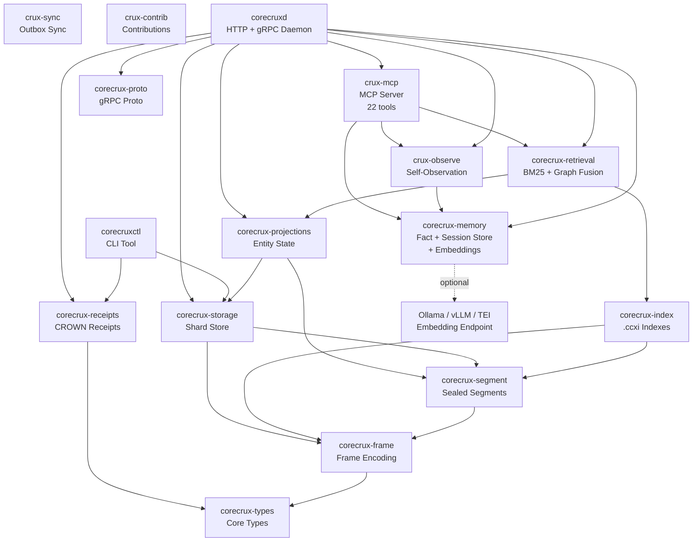

```
 ██████╗██████╗ ██╗   ██╗██╗  ██╗
██╔════╝██╔══██╗██║   ██║╚██╗██╔╝
██║     ██████╔╝██║   ██║ ╚███╔╝
██║     ██╔══██╗██║   ██║ ██╔██╗
╚██████╗██║  ██║╚██████╔╝██╔╝ ██╗
 ╚═════╝╚═╝  ╚═╝ ╚═════╝╚═╝  ╚═╝
```

# Crux - Community Edition

[](https://github.com/CueCrux/Crux/actions/workflows/ci.yml)
[](https://github.com/CueCrux/Crux)
[-blue)](LICENCE.md)
[](rust-toolchain.toml)
[](https://ghcr.io/cuecrux/crux-community)

> **Naming:** This repository is **Crux**. The daemon binary is `corecruxd`, the CLI is `corecruxctl`, and all Rust crates use the `corecrux-` prefix. Environment variables start with `CORECRUXD_`. When you see "Crux" in prose and `corecrux` in code, they mean the same thing.

## What Crux Is

A source-available, single-binary retrieval engine with built-in cryptographic receipts.

Crux is an append-only event store with BM25 + graph signal retrieval and CROWN receipts baked into every operation. Every query result is signed, every retrieval path is auditable, and every gap in coverage is reported. Optionally, connect a local embedding model (Ollama, vLLM, TEI, or any OpenAI-compatible endpoint) for dense vector retrieval you pick the hardware.

## Licence (read this first)

Crux is **source-available, not open-source.** It is licensed under the [CueCrux Community Licence (CCL v1.0)](LICENCE.md).

| | |
|---|---|
| **Permitted** | Run internally (commercial OK), read/audit source, modify for internal use, contribute back, academic research, build internal tooling on the APIs |
| **Prohibited** | Redistribute as a competing product, offer as a managed/hosted/cloud service |
| **Change clause** | Three years after each versioned release, the code converts to Apache 2.0 |

If you see "open-source" mentioned anywhere outside this repo, that is incorrect. CCL v1.0 grants broad internal-use rights but reserves commercial redistribution.

## What's Included vs. What's Not

Not every feature in the architecture is enabled in every deployment. Here is what you get out of the box:

| Feature | Community Edition | Optional (bring your own) | Hosted / Proprietary only |
|---|:---:|:---:|:---:|
| Append-only event store (BLAKE3 integrity) | **yes** | | |
| CROWN receipts (Ed25519 signed) | **yes** | | |
| Fact store (entity/key/value + confidence) | **yes** | | |
| Session store (scoped agent state) | **yes** | | |
| Built-in MCP server (22 tools) | **yes** | | |
| Prometheus `/metrics` endpoint | **yes** | | |
| HTTP + gRPC APIs | **yes** | | |
| CLI tooling (`verify-store`, `replay`, etc.) | **yes** | | |
| BM25 text search (`.ccxi` companion indexes) | **yes** | | |
| Dense vector retrieval (embeddings) | | Ollama / vLLM / TEI | |
| Graph signal fusion | | | **proprietary** |
| GPU/CUDA acceleration | | | **proprietary** |
| Self-observation (ops error capture) | | | **proprietary** |
| Remote sync (hosted platform) | | | **proprietary** |

The `features` section of `/v1/version` tells you exactly what is active on a running instance.

## Platform Support

| Platform | Docker | Binary | Build from source |
|---|:---:|:---:|:---:|
| Linux x86_64 | **yes** | **yes** | **yes** |
| Linux aarch64 | **yes** | planned | **yes** |
| macOS (Apple Silicon) | **yes** (Rosetta or native) | planned | **yes** |
| macOS (Intel) | **yes** | planned | **yes** |
| Windows (WSL2) | **yes** | - | **yes** (via WSL2) |
| Windows (native) | - | - | not supported |

**Docker is the recommended path** for all platforms. It works everywhere Docker Desktop runs. Build-from-source requires Rust 1.88+ and `protobuf-compiler`.

## Quickstart

### Docker (recommended)

```bash
docker compose up -d
```

The bundled compose stack publishes `14800` (HTTP) and `14801` (MCP) on host loopback only.

### Docker with Ollama (dense vector retrieval)

If you have an Ollama instance already running on your host:

```bash
# Tell Crux where to find it
CORECRUXD_EMBEDDING_URL=http://host.docker.internal:11434 docker compose up -d
```

Or start Ollama alongside Crux (auto-pulls `nomic-embed-text`):

```bash
docker compose --profile embeddings up -d
```

This starts Ollama with GPU passthrough and pulls the `nomic-embed-text` model automatically. Ollama handles hardware detection - it works on NVIDIA, AMD, Apple Silicon, and CPU-only machines. You choose the model; Crux just calls the endpoint.

To use a different model:

```bash
CORECRUXD_EMBEDDING_MODEL=mxbai-embed-large docker compose --profile embeddings up -d
```

### Binary (Linux x86_64)

```bash
curl -sSL https://github.com/CueCrux/Crux/releases/latest/download/corecruxd-linux-amd64 -o corecruxd
chmod +x corecruxd
CORECRUXD_AUTH_MODE=off CORECRUXD_DATA_DIR=./data ./corecruxd
```

### Build from Source

```bash
git clone https://github.com/CueCrux/Crux.git
cd Crux
cargo build --release
CORECRUXD_AUTH_MODE=off CORECRUXD_DATA_DIR=./data ./target/release/corecruxd
```

## Five-Minute Walkthrough

1. **Start the server:**
   ```bash
   docker compose up -d
   ```

2. **Verify it's ready:**
   ```bash
   curl -sf http://localhost:14800/readyz
   ```
   Expected: `{"ok":true}`. The `/healthz` endpoint checks if the process is alive; `/readyz` checks if it can serve traffic.

3. **Inspect enabled features:**
   ```bash
   curl -s http://localhost:14800/v1/version | jq .features
   ```
   ```json
   {
     "text_search": false,
     "graph_expand": false,
     "self_observe": false,
     "mcp": true,
     "embeddings": false
   }
   ```
   `embeddings` becomes `true` when you set `CORECRUXD_EMBEDDING_URL`. `text_search` and `graph_expand` require the data-plane store (sealed segments with `.ccxi` indexes). The fact store, sessions, MCP server, and health endpoints work immediately.

4. **Store a fact:**

   The default Docker stack runs with `CORECRUXD_AUTH_MODE=dev_scopes`, which requires a scopes header on every request. For quick local testing, you can start with `CORECRUXD_AUTH_MODE=off` instead. With `dev_scopes`:

   ```bash
   curl -s -X PUT http://localhost:14800/v1/facts \
     -H "Content-Type: application/json" \
     -H "X-Corecrux-Scopes: facts:write,facts:read,admin:read" \
     -d '{
       "entity": "project",
       "key": "status",
       "value": "Phase 1 complete - 12 milestones delivered",
       "confidence": 0.95
     }' | jq .
   ```
   Response:
   ```json
   {
     "fact_id": "f_01J...",
     "entity": "project",
     "key": "status",
     "value": "Phase 1 complete - 12 milestones delivered",
     "confidence": 0.95,
     "version": 1
   }
   ```

5. **Query facts:**
   ```bash
   curl -s "http://localhost:14800/v1/facts?query=project+status&token_budget=500" \
     -H "X-Corecrux-Scopes: facts:read,admin:read" | jq .facts
   ```

6. **Inspect the built-in MCP server:**
   ```bash
   curl -s -X POST http://localhost:14801/mcp \
     -H "Content-Type: application/json" \
     -d '{"jsonrpc": "2.0", "id": 1, "method": "tools/list"}' | jq '.result.tools | length'
   ```
   Expected: `22`

7. **Verify store integrity:**
   ```bash
   docker exec crux-crux-1 corecruxctl verify-store --data-dir /data --scope recent
   ```
   On a fresh instance with no sealed segments, this returns `{"ok": true, "scannedShards": 0}`. After appending events and sealing segments, it will scan BLAKE3 hashes and frame checksums.

If you are integrating Crux into another system, agents can pull the seeded onboarding playbooks at runtime with `get_bootstrap(topic="docs", query="integration")`. For upgrades, pair `update_status()` with `get_bootstrap(topic="docs", query="upgrade")` and `get_bootstrap(topic="docs", query="backup")`. Those playbooks live in [`crates/crux-observe/bootstrap_data/docs.json`](crates/crux-observe/bootstrap_data/docs.json).

## Embedding Models

Crux does not ship an embedding model. Instead, it connects to any service that exposes an Ollama-compatible `/api/embed` endpoint. This means **you choose the model and hardware**:

| Provider | GPU support | Install |
|---|---|---|
| [Ollama](https://ollama.com) | NVIDIA, AMD, Apple Silicon, CPU | `ollama pull nomic-embed-text` |
| [vLLM](https://docs.vllm.ai) | NVIDIA | `vllm serve nomic-embed-text` |
| [TEI](https://github.com/huggingface/text-embeddings-inference) | NVIDIA | Docker image |
| [llama.cpp](https://github.com/ggml-org/llama.cpp) | NVIDIA, AMD, Apple Silicon, Vulkan, CPU | Build from source |
| [LiteLLM](https://docs.litellm.ai) | Proxy to any provider | `pip install litellm` |

### Configuration

Set two environment variables:

```bash
CORECRUXD_EMBEDDING_URL=http://localhost:11434   # Ollama default
CORECRUXD_EMBEDDING_MODEL=nomic-embed-text       # or any model your endpoint serves
```

When set, Crux will:
- Embed each fact at store time (entity + key + value concatenated)
- Embed the query string at query time
- Rank results by `0.6 * cosine_similarity + 0.4 * confidence` instead of keyword matching

When unset, Crux uses keyword matching only - no external dependencies required.

### Recommended models

| Model | Dimensions | Good for |
|---|---|---|
| `nomic-embed-text` | 768 | General purpose, fast, good quality/size ratio |
| `mxbai-embed-large` | 1024 | Higher quality, more memory |
| `all-minilm` | 384 | Smallest footprint, fastest inference |

## API Reference

### Core Endpoints

| Method | Path | Description |
|---|---|---|
| GET | `/healthz` | Health check with build metadata |
| GET | `/readyz` | Readiness check |
| GET | `/metrics` | Prometheus metrics |
| GET | `/v1/version` | Version, features, sync, and update status |
| POST | `/v1/admin/append` | Append events to a stream |
| POST | `/v1/query/text-search` | BM25 + graph signal retrieval |
| POST | `/v1/query/graph-expand` | Graph traversal with budget |
| POST | `/v1/query/time-range` | Temporal range queries |
| PUT | `/v1/facts` | Store a shared fact |
| GET | `/v1/facts` | Query shared facts |
| GET | `/v1/receipts/{id}` | Retrieve a CROWN receipt |
| GET | `/v1/receipts/{id}/verification` | Verify receipt signature |

### CLI Tools

| Command | Description |
|---|---|
| `corecruxctl verify-store` | Cryptographic integrity check on corpus |
| `corecruxctl replay` | Deterministic replay with drift classification |
| `corecruxctl receipts` | Receipt tooling and export |
| `corecruxctl ccxi` | Companion index inspection |
| `corecruxctl projections` | Projection state management |

## Architecture



## Configuration

Crux is configured via environment variables:

| Variable | Default | Description |
|---|---|---|
| `CORECRUXD_DATA_DIR` | `../CoreCruxData/v1` | Data directory for segments |
| `CORECRUXD_HTTP_PORT` | `14800` | HTTP API port |
| `CORECRUXD_GRPC_PORT` | `4007` | gRPC API port |
| `CORECRUXD_MCP_PORT` | `14801` | Built-in MCP port |
| `CORECRUXD_MCP_ENABLED` | `true` | Enable built-in MCP server |
| `CORECRUXD_BUILD_CCXI` | `0` | Build `.ccxi` indexes at seal time |
| `CORECRUXD_AUTH_MODE` | *(required)* | `off`, `dev_scopes`, `jwt_hs256`, or `jwt_jwks` |
| `CORECRUXD_EMBEDDING_URL` | *(unset)* | Embedding endpoint URL (enables dense retrieval) |
| `CORECRUXD_EMBEDDING_MODEL` | `nomic-embed-text` | Model name for the embedding endpoint |
| `CORECRUX_LOG_FORMAT` | `text` | Log format (`text` or `json`) |
| `CORECRUXD_UPDATE_CHECK_ENABLED` | `true` | Background git-based update checks |

See `config.example.env` for the full list with descriptions.

## MCP Server (for AI Agents)

Crux includes a built-in MCP server on port **14801** with 22 tools for retrieval, fact storage, sessions, sync, update status, decisions, and multi-agent handoff.

### Connect an agent

**Claude Desktop / Claude Code:** Copy `examples/mcp-configs/claude-desktop.json` into your Claude config. See `examples/mcp-configs/README.md` for paths.

**Cursor:** Copy `examples/mcp-configs/cursor.json` to `.cursor/mcp.json`.

**Verify the connection:**
```bash
curl -s -X POST http://localhost:14801/mcp \
  -H "Content-Type: application/json" \
  -d '{"jsonrpc": "2.0", "id": 1, "method": "tools/list"}' | jq '.result.tools | length'
# Expected: 22
```

If you configure `CRUX_AGENT_TOKEN` or `CRUX_AGENT_TOKENS`, send the matching Bearer token on MCP requests. If you rely on handoff packages across restarts or multiple replicas, also set `CRUX_MCP_HANDOFF_SECRET`.

### Agent quickstart (first 3 calls)

1. `get_bootstrap("patterns")` - learn usage patterns
2. `store_fact(entity="test", key="hello", value="world")` - store your first fact
3. `query_facts(query="hello")` - retrieve it

For maintenance and onboarding:

- `update_status()` or `/v1/version.update` tells humans and agents whether the checkout is `current`, `behind`, `ahead`, `diverged`, `disabled`, or `unavailable`.
- Use `get_bootstrap(topic="docs", query="upgrade")` for the upgrade playbook.
- Use `get_bootstrap(topic="docs", query="backup")` for current backup and rollback options.

See `docs/agent-guide.md` for the full agent integration guide.

## Troubleshooting

See `docs/troubleshooting.md` for common issues and fixes.

## Licence

Crux Community Edition is licensed under the [CueCrux Community Licence (CCL v1.0)](LICENCE.md).

- **Source-available, not open-source**
- Free to use, read, audit, modify, and build on for internal use
- Contributions welcome via the published process
- Three years after each release, the code converts to Apache 2.0
- GPU acceleration and hosted platform features are not included

Copyright (c) 2026 CueCrux Ltd. All rights reserved.
