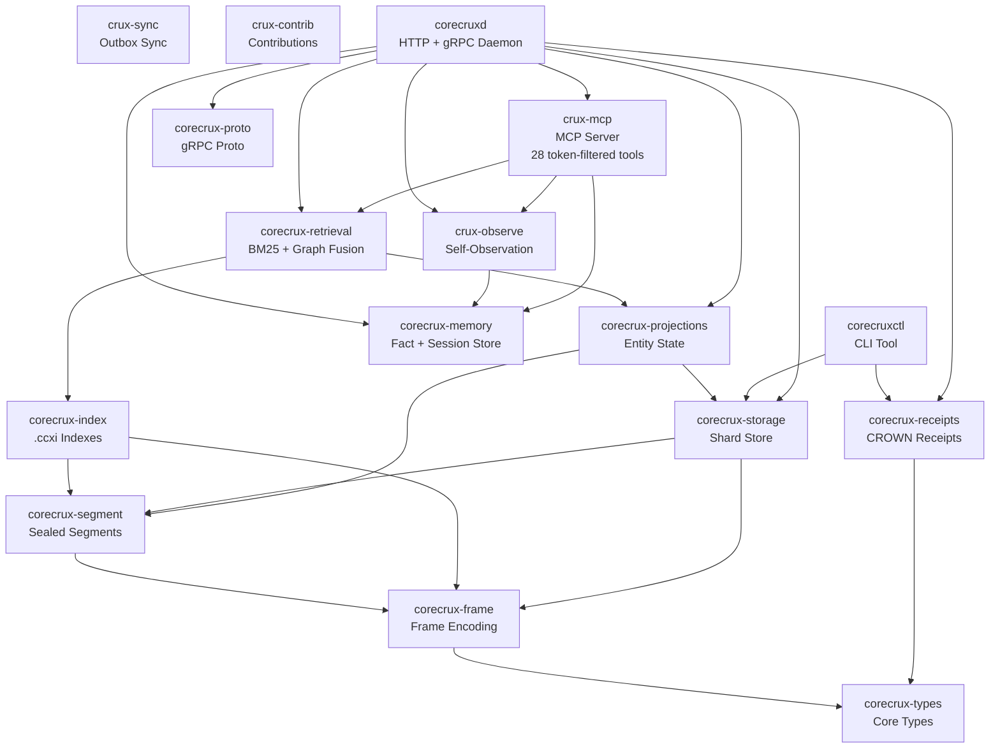

# Architecture

## Crate Dependency Graph



## Data Flow

### Append Path

1. Client sends events via HTTP `POST /v1/admin/append` (or compatibility alias `POST /v1/append`) or gRPC `AppendBatch`.
2. `corecruxd` routes to shard via `stream_hash(tenant_id, stream_type, stream_id)`.
3. Events encoded as frames (`corecrux-frame`) and appended to shard (`corecrux-storage`).
4. When segment fills, it is sealed with BLAKE3 integrity hash.
5. `.ccxi` companion index built at seal time (`corecrux-index`).
6. AppendBatch returns write-confirmation material. If a segment is sealed, the response also includes
   a segment-seal receipt signed over the current segment hash and previous sealed segment hash.
   Stored receipt streams use `corecrux-receipts` for Ed25519-signed CROWN bodies/signatures.

In the default Crux Daemon runtime, the dataplane is disabled, so append
requires a dataplane-enabled deployment.

### Query Path

1. Client sends query via HTTP or MCP tools.
2. BM25 scoring across all `.ccxi` indexes (`corecrux-retrieval`).
3. Optional graph signal fusion from entity relations (`corecrux-projections`).
4. Results filtered by `tenant_hash_lo16` for isolation.
5. Token budget applied to trim results.
6. Coverage score and gaps computed from query token match rates.

### Memory Path

1. Shared facts are stored via `PUT /v1/facts`; private or agent-scoped facts are stored via MCP `store_fact`.
2. Facts indexed in-memory (`corecrux-memory` FactStore).
3. BM25 keyword search over fact values.
4. Token-budgeted retrieval of facts.

### Fleet coordination

The local coordination plane (`/v1/coord/*`) ships in the free daemon and is
enabled by default. It provides the operator's presence-joined session board
and advisory local claims; it is not tier-gated. Governance packaging applies
only to hosted fleet-wide aggregation, attribution, and policy enforcement in
CruxEngine, outside this repository. A local daemon therefore keeps its full
coordination surface whether or not it is connected to hosted services.

## Crate Responsibilities

### Core Storage Layer

- **corecrux-types** -- Shared types, error codes, evidence structs.
- **corecrux-frame** -- Frame encoding (header + payload, BLAKE3 hashed). Wire format: `CRX1` magic, version, header length, payload length, header bytes, payload bytes, CRC32 checksum.
- **corecrux-segment** -- Sealed segment format. Active segments accept frame writes until sealed. Sealed segments contain a 4096-byte header (`CCS3` magic), record area (LZ4 compressed frame blocks), table of contents (`TOC1` magic with 64-byte entries), optional trailer index (block metadata + bloom filters + TOC-by-offset), and a 256-byte footer (`CCF3` magic) with BLAKE3 integrity hashes and CRC32C checksums.
- **corecrux-storage** -- Shard storage engine. Manages append, seal, and crash recovery across multiple shards. Routes events to shards by stream hash.

### Retrieval Layer

- **corecrux-index** -- `.ccxi` companion index. Built at seal time alongside each sealed segment. Contains a vocabulary table (token hash to posting list offset), PForDelta-compressed posting lists with per-token term frequencies, and a per-document table (frame offset, document length in tokens, tenant hash). v2 format extends doc entries to 16 bytes with full 64-bit tenant hash for exact tenant isolation.
- **corecrux-retrieval** -- BM25 scoring with optional graph signal fusion. Reads `.ccxi` indexes, scores candidate documents, applies tenant filtering, and computes coverage gaps.
- **corecrux-projections** -- Entity and relationship state derived from events. Provides graph signals for retrieval fusion.

### Application Layer

- **corecrux-memory** -- In-memory fact store and session store. Facts are key-value pairs with entity, confidence, and timestamps. BM25 keyword search over fact values with token budgets.
- **corecrux-receipts** -- CROWN receipt generation and verification for receipt-bearing streams. Ed25519-signed receipts bind receipt IDs to payload hashes.
- **corecrux-proto** -- gRPC protocol buffer definitions for the `AppendBatch`, `ReadStream`, and query RPCs.

### Server Layer

- **corecruxd** -- HTTP (axum, port 14800), gRPC (tonic, port 4007), and built-in MCP (port 14801 by default) daemon. Manages shard lifecycle, routes requests, serves Prometheus metrics at `/metrics`, and provides health/readiness endpoints.
- **corecruxctl** -- CLI tool with subcommands: `verify-store` (structural integrity, plus sealed-segment BLAKE3 with `--strict`), `replay` (deterministic replay with drift classification), `receipts` (receipt tooling and export), `ccxi` (companion index inspection), `projections` (projection state management).

### Agent And Extension Layer

- **crux-mcp** -- MCP router and token-filtered tool surface for agent interaction. Handles agent identity, tool routing, update awareness, constraints, passport, sync, and handoffs.
- **crux-observe** -- Self-observation subsystem. Provides ops monitoring, bootstrap sequencing, and cold gate logic.
- **crux-sync** -- Outbox sync with VaultCrux. Manages event replication to external systems.
- **crux-contrib** -- Contribution manifest builder. Tracks and packages community contributions.

## Segment File Layout

```
+---------------------------+
| Segment Header (4096 B)   |  CCS3 magic, version, shard_id, epoch, segment_seq, CRC32C
+---------------------------+
| Record Area               |  Frame data (optionally LZ4 block-compressed)
|   Frame 0                 |    CRX1 magic, header bytes, payload bytes, CRC32
|   Frame 1                 |
|   ...                     |
+---------------------------+
| Table of Contents         |  TOC1 magic, entry_count, 64-byte entries sorted by (stream_hash, seq)
|   TOC Header (128 B)      |    Each entry: stream_hash, seq, record_off, frame_len, payload_len,
|   TOC Entry 0 (64 B)      |    event_id_hash16, header_digest8, payload_digest8
|   TOC Entry 1 (64 B)      |
|   ...                     |
+---------------------------+
| Trailer Index (optional)  |  Block metadata (BLK1), TOC-by-offset (TBO1), trailer summary (TSI1)
|   Block Meta per block    |    Per-block: offsets, sizes, codec, frame count, bloom filter
|   TOC-by-offset entries   |
|   Trailer Summary         |
+---------------------------+
| Segment Footer (256 B)    |  CCF3 magic, version, flags, file_len, area offsets/lengths,
|                           |  min/max stream_hash, min/max seq, BLAKE3 hashes, CRC32C
+---------------------------+
```

## .ccxi Index File Layout

```
+---------------------------+
| CCXI Header (256 B)       |  CCXI magic, version 2, shard_id, segment_seq, epoch,
|                           |  vocab_size, total_postings, total_frames, tokenizer_version
+---------------------------+
| Vocab Table               |  vocab_size x 16 bytes: token_hash (u64), postings_offset (u32),
|                           |  postings_len (u32). Sorted by token_hash for binary search.
+---------------------------+
| Postings Area             |  PForDelta-compressed doc_id lists + raw u16 term frequencies
|                           |  per vocab entry.
+---------------------------+
| Doc Table                 |  total_frames x 16 bytes: frame_offset (u32),
|                           |  doc_length_tokens (u16), tenant_hash_lo16 (u16),
|                           |  tenant_hash_full (u64).
+---------------------------+
| CCXI Footer (64 B)        |  BLAKE3 hash of vocab table + BLAKE3 hash of postings area.
+---------------------------+
```
